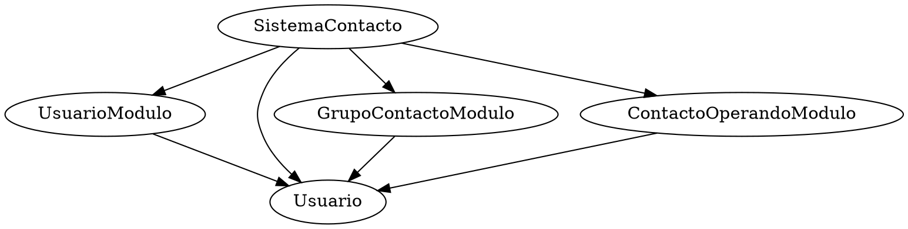
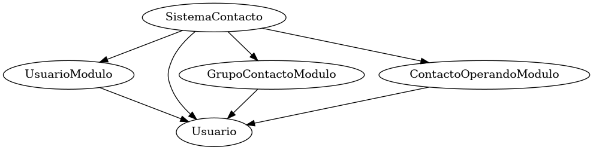
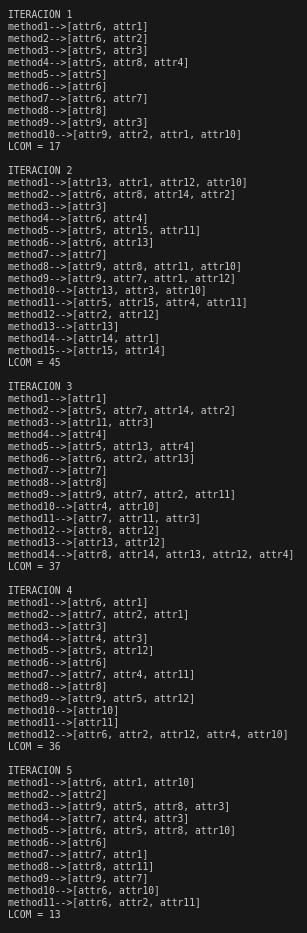

# MÉTRICAS DE CALIDAD
## MÉTRICAS DE ACOPLAMIENTO
**ACOPLAMIENTO**: medida en que los módulos de un sistema de software dependen entre sí. Bajo acoplamiento reduce la complejidad. **MÉTRICAS DE ACOPLAMIENTO** identifica dependencia entre componentes y evalúa calidad de diseño.
1. Acoplamiento eferente (`ce`): Mide el número de tipos o clases externo que un módulo utiliza. Alto ce complica pruebas. (cantidad de clases externas usadas por la clase actual)
2. Acoplamiento aferente (`ca`): Mide el número de tipos o clases externos que dependede de un módulo actual. Alto ca indica importancia. (cantidad de clases externas utilizadas por la actual)
3. Factor de acoplamiento (`cf`) [0,1]: Evalúa grado de acoplamiento entre módulos del sistema. `cf = e/(a(n-1))` e = total de conexiones de acoplamiento reales (suma de ce y ca) a = número de módulos del sistema n = total de módulos. cf bajo indica menor acoplamiento, y mayor modularidad y matenibilidad.
4. Inestabilidad (`I`) [0,1]: Mide la volatilidadj potencial de un módulo dentro de la arquitectura `I = ce/(ca + ce)` I = 0 completamente estable y I = 1 completamente inestable
### EJERCICIO A: hallar las métricas de acoplamiento
```java
// Módulo de Usuarios
class UsuarioModulo {
    private List<Usuario> usuarios = new ArrayList<>();
    public void agregarUsuario(Usuario usuario) {
        usuarios.add(usuario);
        GrupoContactoModulo.agregarUsuarioAGrupo(usuario, "General");
    }
    public void eliminarUsuario(String nombre) {
        usuarios.removeIf(u -> u.getNombre().equals(nombre));
    }
}
// Módulo de Grupos de Contactos
class GrupoContactoModulo {
    static Map<String, List<Usuario>> grupos = new HashMap<>();
    static {
        grupos.put("General", new ArrayList<>());
    }
    public static void agregarUsuarioAGrupo(Usuario usuario, String grupoNombre) {
        grupos.get(grupoNombre).add(usuario);
    }
    public static void crearGrupo(String nombre) {
        if (!grupos.containsKey(nombre)) {
            grupos.put(nombre, new ArrayList<>());
        }
    }
}
// Módulo de Operaciones de Contacto
class ContactoOperacionesModulo {
    public void enviarMensaje(String mensaje, Usuario usuario) {
        System.out.println("Enviando mensaje a " + usuario.getNombre() + ": " + mensaje);
    }
}
// Clase Usuario
class Usuario {
    private String nombre;
    public Usuario(String nombre) {
        this.nombre = nombre;
    }
    public String getNombre() {
        return nombre;
    }
}
// Clase Principal para ejecutar el sistema
public class SistemaContactos {
    public static void main(String[] args) {
        UsuarioModulo usuarioModulo = new UsuarioModulo();
        Usuario nuevoUsuario = new Usuario("Juan");
        usuarioModulo.agregarUsuario(nuevoUsuario);
        ContactoOperacionesModulo operacionesModulo = new ContactoOperacionesModulo();
        operacionesModulo.enviarMensaje("¡Hola!", nuevoUsuario);
        GrupoContactoModulo.crearGrupo("Amigos");
        GrupoContactoModulo.agregarUsuarioAGrupo(nuevoUsuario, "Amigos");
    }
}
```
#### PASO 1: identificar cantidad de clases definidas
se observan cinco clases principales
- `UsuarioModulo`
- `GrupoContactoModulo`
- `ContactoOperacionesModulo`
- `Usuario`
- `SistemaContactos`
#### PASO 2: analizar cada clase identificada
1. UsuarioModulo -> Usuario
- private List<`Usuario`> usuarios = new ArrayList<>();
- public void agregarUsuario(`Usuario` usuario)
2. GrupoContactoModulo-> Usuario
- static Map<String, List<`Usuario`>> grupos = new HashMap<>();
- public static void agregarUsuarioAGrupo(`Usuario` usuario, String grupoNombre)
3. ContactoOperacionesModulo -> Usuario
- public void enviarMensaje(String mensaje, `Usuario` usuario)
4. Usuario -> **
5. SistemaContactos -> UsuarioModulo, Usuario, ContactoOperacionesModulo y GrupoContactoModulo
- `UsuarioModulo` usuarioModulo = new UsuarioModulo()
- `Usuario` nuevoUsuario = new Usuario("Juan");
- `ContactoOperacionesModulo` operacionesModulo = new ContactoOperacionesModulo()
- `GrupoContactoModulo`.crearGrupo("Amigos") y `GrupoContactoModulo`.agregarUsuarioAGrupo(nuevoUsuario, "Amigos")
#### PASO 3: graficar para mejor visualización

```bash
#terminal linux ubuntu (también derivados)
sudo apt-get install graphviz
#ubicarse en donde se a guardado el archivo
dot -Tpng Agenda.dot -o GrafoAgenda.png
#la imagen se genera en el mismo lugar donde está el archivo .dot
```

#### PASO 4: calcular las métricas
1. acoplamiento eferente `ce`
- UsuarioModulo -> Usuario &nbsp;&nbsp;&nbsp;&nbsp;&nbsp; `UsuarioModulo ce = 1` 
- GrupoContactoModulo -> Usuario &nbsp;&nbsp;&nbsp;&nbsp;&nbsp; `GrupoContactoModulo ce = 1`
- ContactoOperacionesModulo -> Usuario &nbsp;&nbsp;&nbsp;&nbsp;&nbsp; `ContactoOperacionesModulo ce = 1`
- Usuario-> ** &nbsp;&nbsp;&nbsp;&nbsp;&nbsp; `Usuario ce = 0`
- SistemaContactos -> UsuarioModulo, Usuario, ContactoOperacionesModulo y GrupoContactoModulo  &nbsp;&nbsp;&nbsp;&nbsp;&nbsp; `SistemaContactos ce = 4`
2. acoplamiento eferente `ca`
- SistemaContactos -> UsuarioModulo &nbsp;&nbsp;&nbsp;&nbsp;&nbsp; `UsuarioModulo ca = 1`
- SistemaContactos -> GrupoContactoModulo &nbsp;&nbsp;&nbsp;&nbsp;&nbsp; `GrupoContactoModulo ca = 1`
- SistemaContactos -> ContactoOperacionesModulo &nbsp;&nbsp;&nbsp;&nbsp;&nbsp; `ContactoOperacionesModulo ca = 1`
- UsuarioModulo, GrupoContactoModulo, ContactoOperacionesModulo y SistemaContactos -> Usuario &nbsp;&nbsp;&nbsp;&nbsp;&nbsp; `Usuario ca = 4`
- ** -> SistemaContactos &nbsp;&nbsp;&nbsp;&nbsp;&nbsp; `SistemaContactos ca = 0`
3. factor de acoplamiento `cf`
- cf = $\frac{e}{a(n-1)}$
- e = (1 + 1 + 1 + 0 + 4) + (1 + 1 + 1 + 4 + 0) = 14
- a = 5
- n = 5
- cf = $\frac{14}{5(5-1)}$ = 0.7 &nbsp;&nbsp;&nbsp;&nbsp;&nbsp; `cf = 0.7`
4. inestabilidad `I`
- I = ce/(ca + ce)
- UsuarioModulo -> I = 1/(1 + 1) = 0.5 &nbsp;&nbsp;&nbsp;&nbsp;&nbsp; `UsuarioModulo I = 0.5`
- GrupoContactoModulo -> I = 1/(1 + 1) = 0.5 &nbsp;&nbsp;&nbsp;&nbsp;&nbsp; `GrupoContactoModulo I = 0.5`
- ContactoOperacionesModulo -> I = 1/(1 + 1) = 0.5 &nbsp;&nbsp;&nbsp;&nbsp;&nbsp; `ContactoOperacionesModulo I = 0.5`
- Usuario-> I = 0/(4 + 0) = 0 &nbsp;&nbsp;&nbsp;&nbsp;&nbsp; `Usuario I = 0`
- SistemaContactos -> I = 4/(0 + 4) = 1 &nbsp;&nbsp;&nbsp;&nbsp;&nbsp; `SistemaContactos I = 1`
- ... del sistema ...
  - ce reales = (1 + 1 + 1 + 0 + 4) = 7
  - ca reales = (1 + 1 + 1 + 4 + 0) = 7
  - `I del sistema = 7/(7 + 7) = 0.5`
## MÉTRICAS DE COHESIÓN
**COHESIÓN**: medida en que las tareas realizadas por un módulo son funcionalmente relacionadas. Alta cohesión tareas bien definidar sin sobrecargas innesarias. **MÉTRICAS DE COHESIÓN** identifica el grado de interrelación o dependencia interna de un módulo o componente en un sistema.
1. `LCOM` (Lack of Cohesion of Methods): Mide la cohesión de una clase calculando la
diferencia entre el número de pares de métodos que no comparten campos de clase (atributos de instancia) `P`y aquellos que sí `Q` entonces `LCOM = |P| - |Q|`. Alto LCOM sugiere dividir en múltiples clases más cohesivas. Si LCOM negativo, se considera cero (alta coheesión). EJERCICIOS B, C, 1, 2, 3
3. `LCOM4`: Mide la cohesión en términos de componentes conectados dentro de una clase. Alto ca indica importancia. (cantidad de clases externas utilizadas por la actual)
4. `CAMC` (Cohesion Among Methods in Class):  Evalúa grado de acoplamiento entre módulos del sistema. `cf = e/(a(n-1))` e = total de conexiones de acoplamiento reales (suma de ce y ca) a = número de módulos del sistema n = total de módulos. cf bajo indica menor acoplamiento, y mayor modularidad y matenibilidad.
### EJERCICIO B: hallar el LCOM
```java
import java.util.*;
public class EmployeeManager {
    public void addEmployee(String name, String department) {
        // Añade un empleado al departamento
        System.out.println("Empleado añadido");
    }
    public void removeEmployee(String name) {
        // Elimina un empleado
        System.out.println("Empleado eliminado");
    }
    public void changeDepartment(String employeeName, String newDepartment) {
        // Cambia un empleado de departamento
        System.out.println("Departamento cambiado");
    }
    public void printDepartmentReport(String department) {
        // Imprime un informe del departamento
        System.out.println("Informe del departamento " + department);
    }
    public void printAllDepartments() {
        // Imprime todos los departamentos
        System.out.println("Lista de todos los departamentos");
    }
}
```
#### PASO 1: identificar métodos y sus atributos
se observan 5 métodos de la clase `EmployeeManager`
- `addEmployee` -> sin atributos 
- `removeEmployee` -> sin atributos 
- `changeDepartment` -> sin atributos  
- `printDepartmentReport` -> sin atributos  
- `printAllDepartments` -> sin atributos  
#### PASO 2: analizar los pares de métodos
1. ... que no comparten atributos
- ningún método tiene atributo, por lo que todas las combinaciones son aceptadas `P = 2C5 = 10`
2. ... que comparten atributos
- ningún método tiene atributo, por lo que no hay casos disponibles `Q = 0`
#### PASO 3: calcular el LCOM
- LCOM = |P| - |Q| = 10 - 0 = 10
- `LCOM = 10` sugiere baja cohesión por métodos independientes entre sí
### EJERCICIO C: hallar el LCOM
```java
import java.util.*;
public class LCOMCalculator {
    private static class ClassInfo {
        List<String> methods = new ArrayList<>();
        Map<String, Set<String>> methodAttributes = new HashMap<>();
        Set<String> attributes = new HashSet<>();
        public void addMethod(String methodName, Set<String> attrs) {
            methods.add(methodName);
            methodAttributes.put(methodName, attrs);
            attributes.addAll(attrs);
        }
    }
    public static void main(String[] args) {
        ClassInfo classInfo = new ClassInfo();
        // Simulación de entrada de métodos y sus accesos a atributos
        classInfo.addMethod("method1", new HashSet<>(Arrays.asList("attr1", "attr2")));
        classInfo.addMethod("method2", new HashSet<>(Arrays.asList("attr2")));
        classInfo.addMethod("method3", new HashSet<>(Arrays.asList("attr3")));
        int p = 0, q = 0;
        List<String> methods = classInfo.methods;
        for (int i = 0; i < methods.size(); i++) {
            for (int j = i + 1; j < methods.size(); j++) {
                String method1 = methods.get(i);
                String method2 = methods.get(j);
                Set<String> attrs1 = classInfo.methodAttributes.get(method1);
                Set<String> attrs2 = classInfo.methodAttributes.get(method2);
                // Calculamos si comparten atributos
                Set<String> intersection = new HashSet<>(attrs1);
                intersection.retainAll(attrs2);
                if (intersection.isEmpty()) {
                    p++; // No comparten atributos
                } else {
                    q++; // Comparten al menos un atributo
                }
            }
        }
        int lcom = p - q;
        System.out.println("LCOM = " + lcom);
    }
}
```
#### PASO 0: comprender simulación
- `ClassInfo` tendrá la tarea de simular un método nuevo que puede afectar a atributos indicados cada que se utilize. Se busca un ejemplo genérico para calcular el LCOM de la clase LCOMCalculator simulado
#### PASO 1: identificar métodos y sus atributos
se observan 3 métodos de la clase `LCOMCalculator` (simulación)
- `method1` -> `attr1`, `attr2`
- `method2` -> `attr2`
- `method3` -> `attr3`
#### PASO 2: analizar los pares de métodos 
total de pares 2C3 = 3
1. ... que no comparten atributos `P = 2`
- method1 y method3
- method2 y method3
2. ... que comparten atributos `Q = 1`
- method1 y method2
#### PASO 3: calcular el LCOM
- LCOM = |P| - |Q| = 2 - 1 = 1
- `LCOM = 1` sugiere alta cohesión
- 
### EJERCICIO 1: Extender LCOMCalculator para incluir más métodos y atributos
1. Añade al menos 5 métodos con propósito definido y con diferentes combinaciones de atributos (p.ej., manipular o acceder a diferentes combinaciones de atributos).
```java
import java.util.*;
public class LCOMCalculator {
    private static class ClassInfo {
        List<String> methods = new ArrayList<>();
        Map<String, Set<String>> methodAttributes = new HashMap<>();
        Set<String> attributes = new HashSet<>();

        public void addMethod(String methodName, Set<String> attrs) {
            methods.add(methodName);
            methodAttributes.put(methodName, attrs);
            attributes.addAll(attrs);
        }

        public void imprimir() {
            for (String metodo : methods) {
                System.out.println(metodo + "-->" + methodAttributes.get(metodo));
            }
        }
    }

    public static void main(String[] args) {
        Random rand = new Random();

        ClassInfo classInfo = new ClassInfo();

        int min = 8;
        int max = 15;
        int nMetodos = min + rand.nextInt(max - min + 1);
        for (int i = 0; i < nMetodos; i++) {
            Set<String> atributosList = new HashSet<>();
            for (int j = 0; j < nMetodos; j++) {
                if (rand.nextBoolean()&&rand.nextBoolean()&&rand.nextBoolean() || j == i) {
                    String atributo = "attr" + (j + 1);
                    atributosList.add(atributo);
                }
            }
            classInfo.addMethod("method" + (i + 1), atributosList);
        }
        classInfo.imprimir();

        int p = 0, q = 0;
        List<String> methods = classInfo.methods;
        for (int i = 0; i < methods.size(); i++) {
            for (int j = i + 1; j < methods.size(); j++) {
                String method1 = methods.get(i);
                String method2 = methods.get(j);
                Set<String> attrs1 = classInfo.methodAttributes.get(method1);
                Set<String> attrs2 = classInfo.methodAttributes.get(method2);
                // Calculamos si comparten atributos
                Set<String> intersection = new HashSet<>(attrs1);
                intersection.retainAll(attrs2);
                if (intersection.isEmpty()) {
                    p++; // No comparten atributos
                } else {
                    q++; // Comparten al menos un atributo
                }
            }
        }
        int lcom = p - q;
        System.out.println("LCOM = " + lcom);
    }
}
```
2. Ejecuta el programa y observar cómo cambian los valores de p y q y, por lo tanto, cómo afecta alvalor de LCOM. (se ejecutan 5 veces )
- se ejecuta 5 veces para notar la diferencia
- 
- el valor del LCOM se ve afectado según los atributos que le correspondan a cada método, ya que depende de la variación de p-q = LCOM. Además, observamos que, como p+q en 2Cn, LCOM = 2Cn -2q, que quiere decir que, si un par de métodos pasa de tener unos atributos en común a no tenerlos, el LCOM variará en 2 unidades.
### EJERCICIO 2: Refactorizar LCOMCalculator para mejorar la legibilidad y eficiencia
- Extraer la lógica del cálculo de LCOM a un método separado.
```java
import java.util.*;
public class LCOMCalculator {
    private static class ClassInfo {
        List<String> methods = new ArrayList<>();
        Map<String, Set<String>> methodAttributes = new HashMap<>();
        Set<String> attributes = new HashSet<>();
        public void addMethod(String methodName, Set<String> attrs) {
            methods.add(methodName);
            methodAttributes.put(methodName, attrs);
            attributes.addAll(attrs);
        }
    }
    public static void main(String[] args) {
        ClassInfo classInfo = new ClassInfo();
        // Simulación de entrada de métodos y sus accesos a atributos
        classInfo.addMethod("method1", new HashSet<>(Arrays.asList("attr1", "attr2")));
        classInfo.addMethod("method2", new HashSet<>(Arrays.asList("attr2")));
        classInfo.addMethod("method3", new HashSet<>(Arrays.asList("attr3")));
        calcLCOM(classInfo);
    }
    //***** Método del cálculo ded LCOM extraído en método independiente *****
    public static void calcLCOM(ClassInfo classInfo) {
        int p = 0, q = 0;
        List<String> methods = classInfo.methods;
        for (int i = 0; i < methods.size(); i++) {
            for (int j = i + 1; j < methods.size(); j++) {
                String method1 = methods.get(i);
                String method2 = methods.get(j);
                Set<String> attrs1 = classInfo.methodAttributes.get(method1);
                Set<String> attrs2 = classInfo.methodAttributes.get(method2);
                // Calculamos si comparten atributos
                Set<String> intersection = new HashSet<>(attrs1);
                intersection.retainAll(attrs2);
                if (intersection.isEmpty()) {
                    p++; // No comparten atributos
                } else {
                    q++; // Comparten al menos un atributo
                }
            }
        }
        int lcom = p - q;
        System.out.println("LCOM = " + lcom);
    }
}
```
- Mejorar la estructura de ClassInfo para facilitar la adición de nuevos métodos atributos.
    - `Encapsulación y Abstracción`: la clase Metho busca encapsular la información de cada método (su nombre y sus atributos) en una sola entidad. más modular y fácil de entender
    - `Coherencia y Claridad`: una clase Method separada ayuda a clarificar la estructura y el propósito del código.
    - `Mantenibilidad y Escalabilidad`: Al encapsular la lógica relacionada con los métodos y sus atributos en una clase separada, facilitamos la adición de nuevos métodos y atributos en el futuro. Si queremos agregar funcionalidades específicas a cada método o si necesitamos realizar operaciones específicas en los atributos de cada método, podemos hacerlo fácilmente agregando métodos a la clase Method sin afectar la estructura general del código.
    - `Flexibilidad y Extensibilidad`: implementamos getMethods y getAttributes busco flexibilidad y la extensibilidad del código gracias a su accedo a la información de manera controlada y segura, lo que facilita la integración con otras funcionalidades y componentes.

```java
    private static class Method {
        private String name;
        private Set<String> attributes;
        public Method(String name, Set<String> attributes) {
            this.name = name;
            this.attributes = attributes;
        }
        public String getName() {
            return name;
        }
        public Set<String> getAttributes() {
            return attributes;
        }
    }
    private static class ClassInfo {
        private List<Method> methods = new ArrayList<>();
        private Set<String> attributes = new HashSet<>();
        public void addMethod(String methodName, Set<String> attrs) {
            Method method = new Method(methodName, attrs);
            methods.add(method);
            attributes.addAll(attrs);
        }
        public List<Method> getMethods() {
            return methods;
        }
        public Set<String> getAttributes() {
            return attributes;
        }
    }
```
- Implementar manejo de errores y validaciones para la entrada de datos.
    - el nombre no puede estar vacío
    ```java
    if (methodName == null || methodName.isEmpty()) {
                throw new IllegalArgumentException("El nombre del método no puede estar vacío");
            }
    ```
    - no se puede añadir dos métodos con el mismo nombre
    ```java
    if (methods.stream().anyMatch(method -> method.getName().equals(methodName))) {
                throw new IllegalArgumentException("El método ya existe");
            }
    ```
    - se consideró, pero no se le añade excepción de un método sin atributos porque es posible, pero sí se considera no ingresos de atributos nulos
    ```java
    if (attrs == null) {
                throw new IllegalArgumentException("La lista de atributos no puede estar vacía o ser nula");
            }
    ```
    - se capturan las excepxiones y se imprimem
    ```java
    try {
            classInfo.addMethod("method1", new HashSet<>(Arrays.asList("attr1", "attr2")));
            classInfo.addMethod("method2", new HashSet<>(Arrays.asList("attr2")));
            classInfo.addMethod("method3", new HashSet<>(Arrays.asList("attr3")));

            calcLCOM(classInfo);
        } catch (IllegalArgumentException e) {
            System.err.println("Error: " + e.getMessage());
        }
    ```
- ejercicio finalizado
```java
import java.util.*;

public class LCOMCalculator {
    // Clase para representar la información de la clase
    private static class ClassInfo {
        private List<Method> methods = new ArrayList<>();
        private Set<String> attributes = new HashSet<>();

        public void addMethod(String methodName, Set<String> attrs) {
            if (methodName == null || methodName.isEmpty()) {
                throw new IllegalArgumentException("El nombre del método no puede estar vacío");
            }
            if (methods.stream().anyMatch(method -> method.getName().equals(methodName))) {
                throw new IllegalArgumentException("El método ya existe");
            }
            Method method = new Method(methodName, attrs);
            methods.add(method);
            attributes.addAll(attrs);
        }

        public List<Method> getMethods() {
            return methods;
        }

        public Set<String> getAttributes() {
            return attributes;
        }
    }

    private static class Method {
        private String name;
        private Set<String> attributes;

        public Method(String name, Set<String> attributes) {
            this.name = name;
            this.attributes = attributes;
        }

        public String getName() {
            return name;
        }

        public Set<String> getAttributes() {
            return attributes;
        }
    }

    public static void main(String[] args) {
        ClassInfo classInfo = new ClassInfo();
        // Simulación de entrada de métodos y sus accesos a atributos
        try {
            classInfo.addMethod("method1", new HashSet<>(Arrays.asList("attr1", "attr2")));
            classInfo.addMethod("method2", new HashSet<>(Arrays.asList("attr2")));
            classInfo.addMethod("method3", new HashSet<>(Arrays.asList("attr3")));

            calcLCOM(classInfo);
        } catch (IllegalArgumentException e) {
            System.err.println("Error: " + e.getMessage());
        }
    }

    public static void calcLCOM(ClassInfo classInfo) {
        int p = 0, q = 0;
        List<Method> methods = classInfo.getMethods();
        for (int i = 0; i < methods.size(); i++) {
            for (int j = i + 1; j < methods.size(); j++) {
                Method method1 = methods.get(i);
                Method method2 = methods.get(j);
                Set<String> attrs1 = method1.getAttributes();
                Set<String> attrs2 = method2.getAttributes();
                // Calculamos si comparten atributos
                Set<String> intersection = new HashSet<>(attrs1);
                intersection.retainAll(attrs2);
                if (intersection.isEmpty()) {
                    p++; // No comparten atributos
                } else {
                    q++; // Comparten al menos un atributo
                }
            }
        }
        int lcom = p - q;
        System.out.println("LCOM = " + lcom);
    }
}

```

### Ejercicio 3: Implementar unidades de pruebas para LCOMCalculator
- con el programa ya finalizado se procederá a reestructurarlo para realizar las pruebas de manera satisfactoria 
    - [LCOMCalculator.Method.java](LCOMCalculator/src/main/java/org/example/Method.java)
    - [LCOMCalculator.ClassInfo.java](LCOMCalculator/src/main/java/org/example/ClassInfo.java)
    - [LCOMCalculator.LCOM.java](LCOMCalculator/src/main/java/org/example/LCOM.java)
- Escribe pruebas unitarias para LCOMCalculator, especialmente para la lógica de cálculo de LCOM.
    - Method.java
    ```java
public class MethodTest {
    @Test
    public void testConstructorAndGetters() {
        String name = "testMethod";
        Set<String> attributes = new HashSet<>(Arrays.asList("attr1", "attr2"));
        Method method = new Method(name, attributes);
        assertEquals(name, method.getName(), "getName() debe devolver el nombre del método");
        assertEquals(attributes, method.getAttributes(), "getAttributes() debe devolver el conjunto de atributos");
    }
    @Test
    public void testConstructorWithNullName() {
        try {
            Set<String> attributes = new HashSet<>(Arrays.asList("attr1", "attr2"));
            new Method(null, attributes);
            fail("Se esperaba una excepción NullPointerException");
        } catch (NullPointerException e) {
            // La excepción esperada fue lanzada, la prueba pasa
        }
    }
    @Test
    public void testConstructorWithNullAttributes() {
        try {
            new Method("testMethod", null);
            fail("Se esperaba una excepción NullPointerException");
        } catch (NullPointerException e) {
            // La excepción esperada fue lanzada, la prueba pasa
        }
    }
    @Test
    public void testConstructorWithEmptyAttributes() {
        Set<String> attributes = new HashSet<>();
        Method method = new Method("testMethod", attributes);
        assertTrue(method.getAttributes().isEmpty(), "Los atributos deben ser una lista vacía");
    }
    @Test
    public void testConstructorEmptyAttributes() {
        Set<String> attributes = new HashSet<>();
        Method method = new Method("testMethod", attributes);
        assertTrue(method.getAttributes().isEmpty(), "Los atributos deben ser una lista vacía");
    }
}
    ```
    - ClassInfo.java
    ```java
public class ClassInfoTest {
    private ClassInfo classInfo;
    Set<String> attrs1;
    Set<String> attrs2;
    @BeforeEach
    public void setUp() {
        classInfo = new ClassInfo();
        attrs1 = new HashSet<>(Arrays.asList("attr1", "attr2"));
        attrs2 = new HashSet<>(Arrays.asList("attr3", "attr4"));
    }
    @Test
    public void testAddMethod() {
        assertEquals(0, classInfo.getMethods().size(), "No debe haber método agregado");
        assertEquals(0, classInfo.getAttributes().size(), "No debe haber atributos agregados");

        classInfo.addMethod("method1", attrs1);
        assertEquals(1, classInfo.getMethods().size(), "Debe haber un método agregado");
        assertEquals(2, classInfo.getAttributes().size(), "Debe haber dos atributos agregados");

        classInfo.addMethod("method2", attrs2);
        assertEquals(2, classInfo.getMethods().size(), "Debe haber dos métodos agregados");
        assertEquals(4, classInfo.getAttributes().size(), "Debe haber cuatro atributos agregados");
    }
    @Test
    public void testGetMethods() {
        classInfo.addMethod("method1", attrs1);
        classInfo.addMethod("method2", attrs2);

        List<Method> methods = classInfo.getMethods();
        assertEquals(2, methods.size(), "Debe haber dos métodos en la lista");
        assertEquals("method1", methods.get(0).getName(), "El primer método debe tener nombre 'method1'");
        assertEquals("method2", methods.get(1).getName(), "El segundo método debe tener nombre 'method2'");
    }
    @Test
    public void testGetAttributes() {
        classInfo.addMethod("method1", attrs1);
        classInfo.addMethod("method2", attrs2);

        Set<String> attributes = classInfo.getAttributes();
        assertEquals(4, attributes.size(), "Debe haber cuatro atributos en el conjunto");
        assertTrue(attributes.contains("attr1"), "El conjunto debe contener 'attr1'");
        assertTrue(attributes.contains("attr2"), "El conjunto debe contener 'attr2'");
        assertTrue(attributes.contains("attr3"), "El conjunto debe contener 'attr3'");
        assertTrue(attributes.contains("attr4"), "El conjunto debe contener 'attr4'");
    }
}
    ```
    - LCOM.java
    ```java
public class LCOMTest {
    private final ByteArrayOutputStream outputStreamCaptor = new ByteArrayOutputStream();
    private final PrintStream originalOut = System.out;
    ClassInfo classInfo;
    LCOM lcom;
    @BeforeEach
    public void setUp() {
        System.setOut(new PrintStream(outputStreamCaptor));
        classInfo = new ClassInfo();
        lcom = new LCOM();
    }
    @AfterEach
    public void tearDown() {
        System.setOut(originalOut);
    }
    @Test
    public void testCalcLCOM_NoSharedAttributes() {
        classInfo.addMethod("method1", new HashSet<>(Arrays.asList("attr1", "attr2")));
        classInfo.addMethod("method2", new HashSet<>(Arrays.asList("attr3")));
        lcom.calcLCOM(classInfo);
        assertEquals("LCOM = 1\n", outputStreamCaptor.toString());
    }
    @Test
    public void testCalcLCOM_SharedAttributes() {
        classInfo.addMethod("method1", new HashSet<>(Arrays.asList("attr1", "attr2")));
        classInfo.addMethod("method2", new HashSet<>(Arrays.asList("attr2", "attr3")));
        lcom.calcLCOM(classInfo);
        assertEquals("LCOM = -1\n", outputStreamCaptor.toString());
    }
    @Test
    public void testCalcLCOM_EmptyClassInfo() {
        lcom.calcLCOM(classInfo);
        assertEquals("LCOM = 0\n", outputStreamCaptor.toString());
    }
}
    ```
