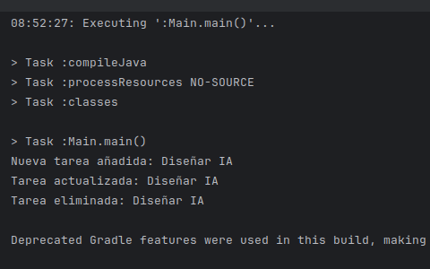
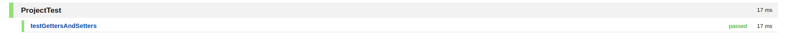
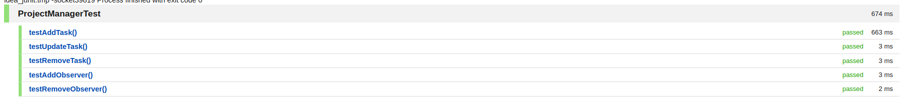
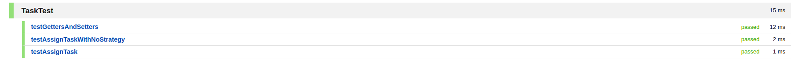

# SOLUCIÓN
# Patrones de diseño:
## Implementar el Patrón Observer para notificar a los usuarios sobre cambios en las tareas.
### definimos el sujeto PROJECT que nos proporcionan
```java
import java.util.ArrayList;
import java.util.List;
import java.time.LocalDate;
public class Project {
    private String name;
    private String description;
    private LocalDate startDate;
    private LocalDate endDate;
    private List<Task> tasks;
    private List<Observer> observers;
    public Project(String name, String description, LocalDate startDate, LocalDate endDate) {
        this.name = name;
        this.description = description;
        this.startDate = startDate;
        this.endDate = endDate;
        this.tasks = new ArrayList<>();
        this.observers = new ArrayList<>();
    }
    public void addTask(Task task) {
        tasks.add(task);
        notifyObservers();
    }
    public void updateTask(Task task) {
        // Lógica para actualizar una tarea
        notifyObservers();
    }
    public void removeTask(Task task) {
        tasks.remove(task);
        notifyObservers();
    }
    private void notifyObservers() {
        for (Observer observer : observers) {
            observer.update();
        }
    }
    public void addObserver(Observer observer) {
        observers.add(observer);
    }
    // Getters y setters para atributos
}
```
- EXPLICACIÓN: se nos brinda la base de la clase Project atributos name, description, startDate, endDate y una lista de Task. Se nos pide implementar el patrón Observer en esta clase y notificar a los usuarios sobre cambios en las tareas, por lo que definiermos las clases Task y Observer para que funcionen de acuerdo con el patrón. 
#### creamos la inteface Observer
```java 
public interface Observer {
    void update(String changeType, Task task);
}

```
- EXPLICACIÓN: Esta interfaz será implementada por cualquier clase que quiera ser notificada de los cambios en el proyecto. Se define de la siguiente manera para mantener el observer.update() de la clase project lo más parecido posible.
#### creamo la clase Task
```java
import java.time.LocalDate;

public class Task {
    private String title;
    private String description;
    private String assignedTo;
    private String status;
    private LocalDate dueDate;

    public Task(String title, String description, String assignedTo, String status, LocalDate dueDate) {
        this.title = title;
        this.description = description;
        this.assignedTo = assignedTo;
        this.status = status;
        this.dueDate = dueDate;
    }

    // Getters y setters
```
- EXPLICACIÓN: esta clase encapsula los datos de una tarea y proporciona métodos para interactuar con estos datos de manera controlada y segura desde otras partes del programa. Según las especificaciones con atributos title, description, assignedTo, status y dueDate, se crea la clase con el constructor respectivo (no se añaden los getter ans setter por espacio)
#### modificamos project
```java
import java.time.LocalDate;
import java.util.ArrayList;
import java.util.List;

public class Project {
    private String name;
    private String description;
    private LocalDate startDate;
    private LocalDate endDate;
    private List<Task> tasks;
    private List<Observer> observers;

    public Project(String name, String description, LocalDate startDate, LocalDate endDate) {
        this.name = name;
        this.description = description;
        this.startDate = startDate;
        this.endDate = endDate;
        this.tasks = new ArrayList<>();
        this.observers = new ArrayList<>();
    }

    public void addTask(Task task) {
        tasks.add(task);
        notifyObservers("added", task);
    }

    public void updateTask(Task task) {
        // Lógica para actualizar una tarea
        notifyObservers("updated", task);
    }

    public void removeTask(Task task) {
        tasks.remove(task);
        notifyObservers("removed", task);
    }

    private void notifyObservers(String changeType, Task task) {
        for (Observer observer : observers) {
            observer.update(changeType, task);
        }
    }

    public void addObserver(Observer observer) {
        observers.add(observer);
    }

    // Getters and setters
}
```
- EXPLICACION: se ha modificado notifyObservers("`CAMBIO`", task) dependiendo de la acción que se haga para que se pueda controlar mejor lo que se realiza en el projecto
#### se busca implementar
```java 
public class TaskNotificationHandler implements Observer {
    @Override
    public void update(String changeType, Task task) {
        switch (changeType) {
            case "added":
                System.out.println("Nueva tarea añadida: " + task.getTitle());
                break;
            case "updated":
                System.out.println("Tarea actualizada: " + task.getTitle());
                break;
            case "removed":
                System.out.println("Tarea eliminada: " + task.getTitle());
                break;
            default:
                System.out.println("Tipo de cambio desconocido");
        }
    }
}
```
- EXPLICACIÓN: se crea la clase TaskNotificationHandler para implementar la interface Observer
```java 
public class Main {
    public static void main(String[] args) {
        // Crear un proyecto
        Project project = new Project("Desarrollo de IA", "Desarrollando módulos de IA", LocalDate.now(), LocalDate.now().plusMonths(3));

        // Agregar observadores
        project.addObserver(new TaskNotificationHandler());

        // Crear y añadir tareas
        Task task1 = new Task("Diseñar IA", "Diseñar la arquitectura de IA", "Jane Doe", "Pendiente", LocalDate.now().plusDays(10));
        project.addTask(task1);

        // Simular actualización de tarea
        task1.setStatus("En Progreso");
        project.updateTask(task1);

        // Simular eliminación de tarea
        project.removeTask(task1);
    }
}
```
- EXPLICACIÓN: se añade una clase main para ejecutar la lógica del proyecto

## Implementar el Patrón Strategy para diferentes estrategias de asignación de tareas.
#### Defino la interfaz Strategy
```java
public interface TaskAssignmentStrategy {
    void assignTask(Task task);
}

```
-EXPLICACIÓN: SE define una interfaz que represente la estrategia de asignación de tareas.

#### añado diferentes estrategia
```java
public class SimpleTaskAssignmentStrategy implements TaskAssignmentStrategy {
    @Override
    public void assignTask(Task task) {
        // Lógica de asignación simple
        task.setAssignedTo("Asignado automáticamente");
    }
}

public class PriorityTaskAssignmentStrategy implements TaskAssignmentStrategy {
    @Override
    public void assignTask(Task task) {
        // Lógica de asignación basada en prioridades
        task.setAssignedTo("Asignado por prioridad");
    }
}

```
-EXPLICACIÓN: se creó clases que implementen esta interfaz para cada estrategia específica
#### modifico clase task
```java 
private TaskAssignmentStrategy assignmentStrategy;
    // Constructor y métodos 
    public void assignTask() {
        if (assignmentStrategy != null) {
            assignmentStrategy.assignTask(this);
        } else {
            throw new IllegalStateException("No se ha especificado una estrategia de asignación");
        }
    }
    public void setAssignmentStrategy(TaskAssignmentStrategy assignmentStrategy) {
        this.assignmentStrategy = assignmentStrategy;
    }
```
-EXPLICACIÓN: para integrar la estrategias se añade un campo estrategia a la clase Task y un método para asignar la tarea usando la estrategias se añade los métodos     assignTask y setAssignmentStrategy
#### se modifica main
```java
public class Main {
    public static void main(String[] args) {
        Project project = new Project("Desarrollo de IA", "Desarrollando módulos de IA", LocalDate.now(), LocalDate.now().plusMonths(3));
        project.addObserver(new TaskNotificationHandler());

        Task task1 = new Task("Diseñar IA", "Diseñar la arquitectura de IA", "Jane Doe", "Pendiente", LocalDate.now().plusDays(10));

        // Asignar estrategia de asignación simple
        task1.setAssignmentStrategy(new SimpleTaskAssignmentStrategy());
        task1.assignTask();
        project.addTask(task1);

        // Cambiar estrategia y asignar tarea
        task1.setAssignmentStrategy(new PriorityTaskAssignmentStrategy());
        task1.assignTask();
        project.updateTask(task1);

        project.removeTask(task1);
    }
}
```
-EXPLICACIÓN: se añaden los cambios implementados para cumplir con el patrón Strategy y el programa siga funcionando correctamente con los nuevos cambios
## Principios SOLID:
### Aplicar Single Responsibility Principle dividiendo las responsabilidades en clases y métodos específicos.
#### EXPLICACION para implementar SRP
- Hasta ahora
    - Project: gestiona tanto la lógica del proyecto como la notificación de cambios (Observer).
    - Task: Representa una tarea con su lógica de asignación.
    - TaskNotificationHandler: Maneja las notificaciones de cambio en las tareas.

- Refactorización:
    - separo la lógica del proyecto y la notificación en clases distintas:
    - creo una nueva clase ProjectManager que se encargue exclusivamente de gestionar las operaciones del proyecto (addTask, updateTask, removeTask, etc.).
    - creo clase Observador para mantener TaskNotificationHandler como está, ya que se ocupa específicamente de manejar las notificaciones de cambio en las tareas.
### codigo modificado con SRP
```java

public class ProjectManager implements Observable {
    private Project project;
    private List<Task> tasks;
    private List<Observer> observers;

    public ProjectManager(Project project) {
        this.project = project;
        this.tasks = new ArrayList<>();
        this.observers = new ArrayList<>();
    }

    public void addTask(Task task) {
        tasks.add(task);
        notifyObservers("added", task);
    }

    public void updateTask(Task task) {
        // Lógica para actualizar una tarea
        notifyObservers("updated", task);
    }

    public void removeTask(Task task) {
        tasks.remove(task);
        notifyObservers("removed", task);
    }

    @Override
    public void addObserver(Observer observer) {
        observers.add(observer);
    }

    @Override
    public void removeObserver(Observer observer) {
        observers.remove(observer);
    }

    @Override
    public void notifyObservers(String changeType, Task task) {
        for (Observer observer : observers) {
            observer.update(changeType, task);
        }
    }
}
- project se queda solo como una clase simple
public class Project {
    private String name;
    private String description;
    private LocalDate startDate;
    private LocalDate endDate;
    private List<Task> tasks;
    private List<Observer> observers;

    public Project(String name, String description, LocalDate startDate, LocalDate endDate) {
        this.name = name;
        this.description = description;
        this.startDate = startDate;
        this.endDate = endDate;
        this.tasks = new ArrayList<>();
        this.observers = new ArrayList<>();
    }

    // Getters and setters
}

```
###  Aplicar Dependency Inversion Principle utilizando inyecciones de dependencia para gestionar las dependencias entre clases.
#### EXPLICACION para implementar DIP
- Hasta ahora 
    - Project y Task dependen directamente de TaskNotificationHandler y Observer.

- Refactorización:
    - introduzco la abstracción observer que define una interfaz Observable que Project pueda usar para notificar eventos a observadores, en lugar de depender directamente de Observer.
    - utilizo la inyección de dependencia para pasar las implementaciones concretas (TaskNotificationHandler) a Project y Task en lugar de crearlas dentro de estas clases.
### codigo modificado con DIP
```java
public interface Observer {
    void update(String changeType, Task task);
}
public interface Observable {
    void addObserver(Observer observer);
    void removeObserver(Observer observer);
    void notifyObservers(String changeType, Task task);
}

```

#### codigo implementación 
- EXPLICACION: 
    - Project ahora solo mantiene información sobre el proyecto.
    - ProjectManager maneja la lógica de agregar, actualizar y eliminar tareas, además de notificar a los observadores.
    - Observable define los métodos para añadir, eliminar y notificar observadores.
    - ProjectManager implementa Observable.
    - TaskNotificationHandler se pasa como una dependencia a ProjectManager.

```java
public class Main {
    public static void main(String[] args) {
        Project project = new Project("Desarrollo de IA", "Desarrollando módulos de IA", LocalDate.now(), LocalDate.now().plusMonths(3));
        ProjectManager projectManager = new ProjectManager(project);
        projectManager.addObserver(new TaskNotificationHandler());

        Task task1 = new Task("Diseñar IA", "Diseñar la arquitectura de IA", "Jane Doe", "Pendiente", LocalDate.now().plusDays(10));

        // Asignar estrategia de asignación simple
        task1.setAssignmentStrategy(new SimpleTaskAssignmentStrategy());
        task1.assignTask();
        projectManager.addTask(task1);

        // Cambiar estrategia y asignar tarea
        task1.setAssignmentStrategy(new PriorityTaskAssignmentStrategy());
        task1.assignTask();
        projectManager.updateTask(task1);

        projectManager.removeTask(task1);
    }
}

```
## Medición de cohesión y acoplamiento:
### Medir la cohesión utilizando la métrica Lack of Cohesion of Methods (LCOM).
### Clase `Project`

#### Atributos
- `name`
- `description`
- `startDate`
- `endDate`

#### Métodos
- `getName`
- `setName`
- `getDescription`
- `setDescription`
- `getStartDate`
- `setStartDate`
- `getEndDate`
- `setEndDate`

#### LCOM
- Métodos que comparten atributos:
  - `getName` y `setName` (comparten `name`)
  - `getDescription` y `setDescription` (comparten `description`)
  - `getStartDate` y `setStartDate` (comparten `startDate`)
  - `getEndDate` y `setEndDate` (comparten `endDate`)
- Métodos que no comparten atributos: 
  - `getName` y `getDescription`
  - `getName` y `getStartDate`
  - `getName` y `getEndDate`
  - `setName` y `setDescription`
  - `setName` y `setStartDate`
  - `setName` y `setEndDate`
  - Total de pares posibles: \( \frac{8(8-1)}{2} = 28 \)

Pares que comparten atributos: 4  
Pares que no comparten atributos: \( 28 - 4 = 24 \)  

- **LCOM = 24 - 4 = 20**

### Clase `Task`

#### Atributos
- `title`
- `description`
- `assignedTo`
- `status`
- `dueDate`
- `assignmentStrategy`

#### Métodos
- `getTitle`
- `setTitle`
- `getDescription`
- `setDescription`
- `getAssignedTo`
- `setAssignedTo`
- `getStatus`
- `setStatus`
- `getDueDate`
- `setDueDate`
- `assignTask`
- `setAssignmentStrategy`

#### LCOM
- Métodos que comparten atributos:
  - `getTitle` y `setTitle` (comparten `title`)
  - `getDescription` y `setDescription` (comparten `description`)
  - `getAssignedTo` y `setAssignedTo` (comparten `assignedTo`)
  - `getStatus` y `setStatus` (comparten `status`)
  - `getDueDate` y `setDueDate` (comparten `dueDate`)
- Métodos que no comparten atributos:
  - `getTitle` y `getDescription`
  - `getTitle` y `getAssignedTo`
  - `getTitle` y `getStatus`
  - `getTitle` y `getDueDate`
  - `getTitle` y `assignTask`
  - `getTitle` y `setAssignmentStrategy`
  - (Se calculan todos los pares posibles que no comparten atributos)

Total de pares posibles: \( \frac{12(12-1)}{2} = 66 \)

Pares que comparten atributos: 5  
Pares que no comparten atributos: \( 66 - 5 = 61 \)  

- **LCOM = 61 - 5 = 56**

#### Clase `ProjectManager`

#### Atributos
- `project`
- `tasks`
- `observers`

#### Métodos
- `addTask`
- `updateTask`
- `removeTask`
- `addObserver`
- `removeObserver`
- `notifyObservers`

#### LCOM
- Métodos que comparten atributos:
  - `addObserver` y `removeObserver` (comparten `observers`)
  - `addTask`, `updateTask`, `removeTask` y `notifyObservers` (comparten `tasks`)
- Métodos que no comparten atributos:
  - `addTask` y `addObserver`
  - `updateTask` y `addObserver`
  - `removeTask` y `addObserver`
  - (Se calculan todos los pares posibles que no comparten atributos)

Total de pares posibles: \( \frac{6(6-1)}{2} = 15 \)

Pares que comparten atributos: 2 (para `observers`) + 6 (para `tasks`) = 8  
Pares que no comparten atributos: \( 15 - 8 = 7 \)  

- **LCOM = 7 - 8 = 0** (LCOM se establece en 0 si el resultado es negativo)

#### Clase `SimpleTaskAssignmentStrategy`

#### Atributos
No tiene atributos.

#### Métodos
- `assignTask`

#### LCOM
Total de pares posibles: 0 (solo un método, no hay pares para comparar)  
- **LCOM = 0**

#### Clase `PriorityTaskAssignmentStrategy`

#### Atributos
No tiene atributos.

#### Métodos
- `assignTask`

#### LCOM
Total de pares posibles: 0 (solo un método, no hay pares para comparar)  
- **LCOM = 0**

#### Clase `TaskNotificationHandler`

#### Atributos
No tiene atributos.

#### Métodos
- `update`

#### LCOM
Total de pares posibles: 0 (solo un método, no hay pares para comparar)  
- **LCOM = 0**

## Resumen de LCOM
- **Clase `Project`: LCOM = 20**
- **Clase `Task`: LCOM = 56**
- **Clase `ProjectManager`: LCOM = 0**
- **Clase `SimpleTaskAssignmentStrategy`: LCOM = 0**
- **Clase `PriorityTaskAssignmentStrategy`: LCOM = 0**
- **Clase `TaskNotificat

### Medir el acoplamiento utilizando el Coupling Factor (CF).
1. Contamos los enlaces entre clases (ejemplo):
    - Main → Project
    - Main → ProjectManager
    - ProjectManager → Task
    - ProjectManager → TaskNotificationHandler
    - Total de enlaces: 4
2. Total de pares posibles: 5(5−1)=205(5−1)=20
3. CF=420=0.2CF=204​=0.2
## Pruebas unitarias:
###  Implementar pruebas unitarias básicas utilizando JUnit 5 para las clases y métodos principales.
#### añado mockito
```groovy
    testImplementation 'org.junit.jupiter:junit-jupiter-api:5.10.0'
    testRuntimeOnly 'org.junit.jupiter:junit-jupiter-engine:5.10.0'
    testImplementation 'org.mockito:mockito-core:5.5.0'
    testImplementation 'org.mockito:mockito-junit-jupiter:5.5.0'
```
- EXPLICACIÓN: Dependencias para usar mockito y junit
##### project test
```java

public class ProjectTest {

    private Project project;

    @BeforeEach
    public void setUp() {
        project = new Project("Desarrollo de IA", "Desarrollando módulos de IA", LocalDate.now(), LocalDate.now().plusMonths(3));
    }

    @Test
    public void testGettersAndSetters() {
        assertEquals("Desarrollo de IA", project.getName());
        project.setName("Nuevo Proyecto");
        assertEquals("Nuevo Proyecto", project.getName());

        assertEquals("Desarrollando módulos de IA", project.getDescription());
        project.setDescription("Nueva Descripción");
        assertEquals("Nueva Descripción", project.getDescription());

        assertEquals(LocalDate.now(), project.getStartDate());
        project.setStartDate(LocalDate.now().minusDays(1));
        assertEquals(LocalDate.now().minusDays(1), project.getStartDate());

        assertEquals(LocalDate.now().plusMonths(3), project.getEndDate());
        project.setEndDate(LocalDate.now().plusMonths(4));
        assertEquals(LocalDate.now().plusMonths(4), project.getEndDate());
    }
}
```

- EXPLICACIÓN:
    - Nombre del proyecto: Verifica que el getter (getName) devuelve el valor inicial "Desarrollo de IA" y luego comprueba que el setter (setName) actualiza el nombre correctamente a "Nuevo Proyecto".
    - Descripción del proyecto: Verifica que el getter (getDescription) devuelve el valor inicial "Desarrollando módulos de IA" y luego comprueba que el setter (setDescription) actualiza la descripción correctamente a "Nueva Descripción".
    - Fecha de inicio: Verifica que el getter (getStartDate) devuelve la fecha inicial (fecha actual) y luego comprueba que el setter (setStartDate) actualiza la fecha de inicio correctamente.
    - Fecha de fin: Verifica que el getter (getEndDate) devuelve la fecha inicial (tres meses después de la fecha actual) y luego comprueba que el setter (setEndDate) actualiza la fecha de fin correctamente.
##### ProjectManager test
```java
public class ProjectManagerTest {

    private Project project;
    private ProjectManager projectManager;
    private Task task;
    private Observer observer;

    @BeforeEach
    public void setUp() {
        project = new Project("Desarrollo de IA", "Desarrollando módulos de IA", LocalDate.now(), LocalDate.now().plusMonths(3));
        projectManager = new ProjectManager(project);
        task = new Task("Diseñar IA", "Diseñar la arquitectura de IA", "Jane Doe", "Pendiente", LocalDate.now().plusDays(10));
        observer = mock(Observer.class);
        projectManager.addObserver(observer);
    }

    @Test
    public void testAddTask() {
        projectManager.addTask(task);
        verify(observer, times(1)).update("added", task);
    }

    @Test
    public void testUpdateTask() {
        projectManager.addTask(task); // Primero añadimos la tarea
        projectManager.updateTask(task);
        verify(observer, times(1)).update("updated", task);
    }

    @Test
    public void testRemoveTask() {
        projectManager.addTask(task); // Primero añadimos la tarea
        projectManager.removeTask(task);
        verify(observer, times(1)).update("removed", task);
    }

    @Test
    public void testAddObserver() {
        assertTrue(projectManager.getObservers().contains(observer));
    }

    @Test
    public void testRemoveObserver() {
        projectManager.removeObserver(observer);
        assertFalse(projectManager.getObservers().contains(observer));
    }
}
```

- EXPLICACIÓN: 
    -  `testAddTask` , `testUpdateTask`, `testRemoveTask`se tutiliza Mockito para verificar que el método update del observer simulado fue llamado una vez con los parámetros "added, updated, removed" y task.
    - testAddObserver Verifica que el observer simulado esté presente en la lista de observadores del projectManager.
    - testRemoveObserver  Verifica que el observer simulado ya no esté presente en la lista de observadores del projectManager.
##### task test
```java
public class TaskTest {

    private Task task;

    @BeforeEach
    public void setUp() {
        task = new Task("Diseñar IA", "Diseñar la arquitectura de IA", "Jane Doe", "Pendiente", LocalDate.now().plusDays(10));
    }

    @Test
    public void testGettersAndSetters() {
        assertEquals("Diseñar IA", task.getTitle());
        task.setTitle("Nuevo Título");
        assertEquals("Nuevo Título", task.getTitle());

        assertEquals("Diseñar la arquitectura de IA", task.getDescription());
        task.setDescription("Nueva Descripción");
        assertEquals("Nueva Descripción", task.getDescription());

        assertEquals("Jane Doe", task.getAssignedTo());
        task.setAssignedTo("John Doe");
        assertEquals("John Doe", task.getAssignedTo());

        assertEquals("Pendiente", task.getStatus());
        task.setStatus("Completado");
        assertEquals("Completado", task.getStatus());

        assertEquals(LocalDate.now().plusDays(10), task.getDueDate());
        task.setDueDate(LocalDate.now().plusDays(5));
        assertEquals(LocalDate.now().plusDays(5), task.getDueDate());
    }

    @Test
    public void testAssignTask() {
        task.setAssignmentStrategy(new SimpleTaskAssignmentStrategy());
        task.assignTask();
        assertEquals("Asignado automáticamente", task.getAssignedTo());
    }

    @Test
    public void testAssignTaskWithNoStrategy() {
        IllegalStateException thrown = assertThrows(IllegalStateException.class, task::assignTask);
        assertEquals("No se ha especificado una estrategia de asignación", thrown.getMessage());
    }
}

```

- EXPLICACIÓN:
    - `testAssignTask` Comprueba que el atributo assignedTo de la tarea se actualiza correctamente a "Asignado automáticamente" según la lógica de la estrategia de asignación.
    - `testAssignTaskWithNoStrategy` Comprueba que el mensaje de la excepción sea "No se ha especificado una estrategia de asignación".