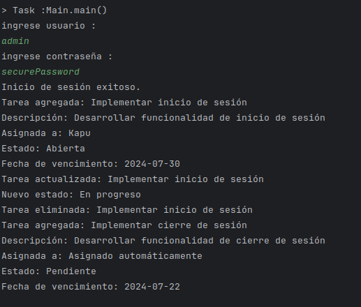
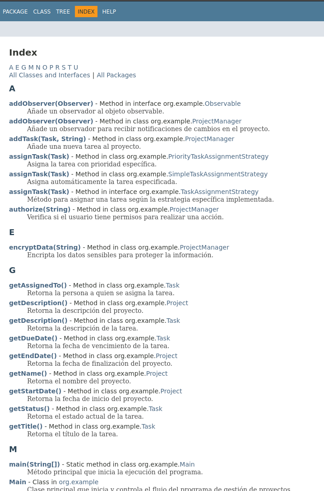

# Perspectivas y tácticas de seguridad:
### modificación de salidas
```java
public class TaskNotificationHandler implements Observer {
    @Override
    public void update(String changeType, Task task) {
        switch (changeType) {
            case "added":
                System.out.println("Tarea agregada: " + task.getTitle());
                System.out.println("Descripción: " + task.getDescription());
                System.out.println("Asignada a: " + task.getAssignedTo());
                System.out.println("Estado: " + task.getStatus());
                System.out.println("Fecha de vencimiento: " + task.getDueDate());
                break;
            case "updated":
                System.out.println("Tarea actualizada: " + task.getTitle());
                System.out.println("Nuevo estado: " + task.getStatus());
                break;
            case "removed":
                System.out.println("Tarea eliminada: " + task.getTitle());
                break;
            default:
                System.out.println("Tipo de cambio desconocido");
        }
    }
}
```
- EXPLICACIÓN: solo se cambia el string que se va a imprimir porque lo demás es la misma lógica que se ha venido implementando
```java
public class Main {
    public static void main(String[] args) {
        // Crear el proyecto
        Project project = new Project("Proyecto Alfa", "Este es un proyecto de prueba", LocalDate.of(2024, 7, 16), LocalDate.of(2025, 1, 16));
        ProjectManager projectManager = new ProjectManager(project);
        projectManager.addObserver(new TaskNotificationHandler());

        // Crear y agregar una tarea
        Task task1 = new Task("Implementar inicio de sesión", "Desarrollar funcionalidad de inicio de sesión", "Kapu", "Abierta", LocalDate.of(2024, 7, 30));
        task1.setAssignmentStrategy(new SimpleTaskAssignmentStrategy()); // Asignación simple inicialmente
        projectManager.addTask(task1);

        // Actualizar la tarea usando la estrategia de prioridad
        task1.setAssignmentStrategy(new PriorityTaskAssignmentStrategy());
        task1.assignTask();
        task1.setStatus("En progreso");
        projectManager.updateTask(task1);

        // Eliminar la tarea
        projectManager.removeTask(task1);

        // Crear y agregar una nueva tarea con la estrategia de asignación simple
        Task task2 = new Task("Implementar cierre de sesión", "Desarrollar funcionalidad de cierre de sesión", "Motita", "Pendiente", LocalDate.now().plusDays(5));
        task2.setAssignmentStrategy(new SimpleTaskAssignmentStrategy());
        task2.assignTask();
        projectManager.addTask(task2);
    }
}

```
- EXPLICACIÓN: la clase Main se cambia con los ingresos del ejemplo y lo demás se ejecuta como se estaba usando
## Implementar Security Perspective y Attack Trees para identificar y mitigar posibles vulnerabilidades.
- se realizan cambios en la clase main simulando seguridad
```java
package org.example;

import java.time.LocalDate;

public class Main {
    public static void main(String[] args) {
        // Crear el proyecto con seguridad básica
        Project project = new Project("Proyecto Alfa", "Este es un proyecto de prueba", LocalDate.of(2024, 7, 16), LocalDate.of(2025, 1, 16));
        ProjectManager projectManager = new ProjectManager(project);
        projectManager.addObserver(new TaskNotificationHandler());

        // Simulación de autenticación básica
        Scanner in = new Scanner(System.in);
        System.out.println("ingrese usuario : ");
        // Simulación de autenticación básica
        String username = in.nextLine(); //admin
        System.out.println("ingrese contraseña : ");
        String password = in.nextLine(); //securePassword

        // Verificación de credenciales
        if (authenticate(username, password)) {
            System.out.println("Inicio de sesión exitoso.");
            
            // Crear y agregar una tarea con autorización
            Task task1 = new Task("Implementar inicio de sesión", "Desarrollar funcionalidad de inicio de sesión", "Kapu", "Abierta", LocalDate.of(2024, 7, 30));
            task1.setAssignmentStrategy(new SimpleTaskAssignmentStrategy());
            projectManager.addTask(task1);

            // Actualizar la tarea usando la estrategia de prioridad
            task1.setAssignmentStrategy(new PriorityTaskAssignmentStrategy());
            task1.assignTask();
            task1.setStatus("En progreso");
            projectManager.updateTask(task1);

            // Eliminar la tarea
            projectManager.removeTask(task1);

            // Crear y agregar una nueva tarea con la estrategia de asignación simple
            Task task2 = new Task("Implementar cierre de sesión", "Desarrollar funcionalidad de cierre de sesión", "Motita", "Pendiente", LocalDate.now().plusDays(5));
            task2.setAssignmentStrategy(new SimpleTaskAssignmentStrategy());
            task2.assignTask();
            projectManager.addTask(task2);
        } else {
            System.out.println("Error: credenciales inválidas.");
        }
    }

    // Método de autenticación básica (simulado)
    private static boolean authenticate(String username, String password) {
        // En una implementación real, aquí se verificarían las credenciales
        return username.equals("admin") && password.equals("securePassword");
    }
}

```
- Explicación:   se añade el método simulado `authenticate` para indicar que se necesita cumplir los requerimientos de usurario y contraseña para que se pueda cumplir en el ingreso, de lo contrario el programa no funcionará


## Aplicar Security Tactics como autenticación, autorización y encriptación.
- en proyectManager se modifica las autorizaciones
```java
// Métodos para añadir, actualizar y eliminar tareas
    public void addTask(Task task, String username) {
        // Verificar autorización antes de agregar la tarea
        if (authorize(username)) {
            tasks.add(task);
            notifyObservers("added", task);
        } else {
            System.out.println("No tienes permisos para agregar tareas.");
        }
    }

    public void updateTask(Task task, String username) {
        // Verificar autorización antes de actualizar la tarea
        if (authorize(username)) {
            // Lógica para actualizar una tarea
            notifyObservers("updated", task);
        } else {
            System.out.println("No tienes permisos para actualizar tareas.");
        }
    }

    public void removeTask(Task task, String username) {
        // Verificar autorización antes de eliminar la tarea
        if (authorize(username)) {
            tasks.remove(task);
            notifyObservers("removed", task);
        } else {
            System.out.println("No tienes permisos para eliminar tareas.");
        }
    }

    // Métodos de seguridad adicionales
    public boolean authorize(String username) {
        return username.equals("admin");
    }

```
- EXPLICACIÓN: se verificará si se cuenta con los permisos necesarios con `authorize` añadiendo una condicional en los métodos `addTask`, `updateTask`, `removeTask` mejorando así la  autenticación del usuario, autorización en el instante y encriptación de no proporcionar los datos si no se tiene los requerimientos necesarios. en este caso particular debe ser admin, pues otro usuario no tendrá los mismos privilegios.
# Estilo de código:
## Mejorar el estilo de código según las mejores prácticas de Code Style Examples. Utilizar herramientas de análisis de estilo de código como Checkstyle.
# Documentación:
## Documentar todas las clases y métodos utilizando JavaDoc.
- se presenta lo que se ha implementado borrando el código por espacio
```java
/**
 * Clase principal que inicia y controla el flujo del programa de gestión de proyectos.
 */
public class Main {
    /**
     * Método principal que inicia la ejecución del programa.
     * @param args Argumentos de la línea de comandos (no utilizado en este programa).
     */
    public static void main(String[] args) {
        // Implementación del programa
    }

    /**
     * Método de autenticación de usuario.
     * @param username Nombre de usuario para autenticar.
     * @param password Contraseña del usuario.
     * @return true si las credenciales son válidas, false en caso contrario.
     */
    private static boolean authenticate(String username, String password) {
        // Implementación de la autenticación
        return false;
    }
}
```

- EXPLICACION: los comentarios se ponen dentro del primer asterisco y los parametro con la etiqueta @param. también para le caso de return la etiqueta * @return . se especifica para los demás en el código adjunto al proyecto [index.html](Image/index.html)
## Medir la Lack of Documentation como una métrica de calidad.
# Pruebas y depuración:
## Implementar pruebas de integración utilizando JUnit 5 y Mockito para pruebas de componentes interconectados (opcional).
#### configurar dependencias en gradle 
```groovy
dependencies {
    testImplementation 'org.junit.jupiter:junit-jupiter-api:5.8.1'
    testRuntimeOnly 'org.junit.jupiter:junit-jupiter-engine:5.8.1'
    testImplementation 'org.mockito:mockito-core:4.2.0'
    testImplementation 'org.mockito:mockito-junit-jupiter:4.2.0'
}
```
- TEST integración con mockito
```java
public class ProjectManagerIntegrationTest {

    private ProjectManager projectManager;
    private Observer mockObserver;
    private String username;

    @BeforeEach
    public void setup() {
        username = "admin";
        // Inicialización del ProjectManager con un proyecto de prueba
        Project project = new Project("Proyecto de Prueba", "Descripción de prueba", LocalDate.now(), LocalDate.now().plusMonths(3));
        projectManager = new ProjectManager(project);

        // Mock del Observer para simular notificaciones
        mockObserver = mock(Observer.class);
        projectManager.addObserver(mockObserver);
    }

    @Test
    public void testAddTask() {
        // Crear una tarea de prueba
        Task task = new Task("Tarea de Prueba", "Descripción de la tarea de prueba", "Usuario Prueba", "Pendiente", LocalDate.now().plusDays(10));

        // Ejecutar el método bajo prueba
        projectManager.addTask(task, username);

        // Verificar que se notifique al Observer correctamente
        ArgumentCaptor<String> changeTypeCaptor = ArgumentCaptor.forClass(String.class);
        ArgumentCaptor<Task> taskCaptor = ArgumentCaptor.forClass(Task.class);
        verify(mockObserver, times(1)).update(changeTypeCaptor.capture(), taskCaptor.capture());

        assertEquals("added", changeTypeCaptor.getValue());
        assertEquals("Tarea de Prueba", taskCaptor.getValue().getTitle());
    }

    @Test
    public void testRemoveTask() {
        // Crear una tarea de prueba
        Task task = new Task("Tarea de Prueba", "Descripción de la tarea de prueba", "Usuario Prueba", "Pendiente", LocalDate.now().plusDays(10));
        projectManager.addTask(task, username);

        // Ejecutar el método bajo prueba
        projectManager.removeTask(task, username);

        // Verificar que se notifique al Observer correctamente
        ArgumentCaptor<String> changeTypeCaptor = ArgumentCaptor.forClass(String.class);
        ArgumentCaptor<Task> taskCaptor = ArgumentCaptor.forClass(Task.class);
        verify(mockObserver, times(1)).update(changeTypeCaptor.capture(), taskCaptor.capture());

        assertEquals("removed", changeTypeCaptor.getValue());
        assertEquals("Tarea de Prueba", taskCaptor.getValue().getTitle());
    }

    @Test
    public void testUpdateTask() {
        // Crear una tarea de prueba
        Task task = new Task("Tarea de Prueba", "Descripción de la tarea de prueba", "Usuario Prueba", "Pendiente", LocalDate.now().plusDays(10));
        projectManager.addTask(task, username);

        // Cambiar el estado de la tarea
        task.setStatus("En Progreso");

        // Ejecutar el método bajo prueba
        projectManager.updateTask(task, username);

        // Verificar que se notifique al Observer correctamente
        ArgumentCaptor<String> changeTypeCaptor = ArgumentCaptor.forClass(String.class);
        ArgumentCaptor<Task> taskCaptor = ArgumentCaptor.forClass(Task.class);
        verify(mockObserver, times(1)).update(changeTypeCaptor.capture(), taskCaptor.capture());

        assertEquals("updated", changeTypeCaptor.getValue());
        assertEquals("Tarea de Prueba", taskCaptor.getValue().getTitle());
        assertEquals("En Progreso", taskCaptor.getValue().getStatus());
    }
}
```
- EXPLICACIÓN:
    -  testAddTask: Verifica que al agregar una tarea, se notifique correctamente al Observer.
    -  testRemoveTask: Verifica que al eliminar una tarea, se notifique correctamente al Observer.
    -  testUpdateTask: Verifica que al actualizar una tarea, se notifique correctamente al Observer.
## Utilizar técnicas de debugging para identificar y solucionar errores.
## Aplicar TDD: Red-Green-Refactor para nuevas funcionalidades.