# solucionario
# SPRINT 1
## Diseño y implementación inicial
### 1. Diseñar las clases responsables de manejar las condiciones climáticas (Temperatura, Lluvia, Viento).
- Clases SIN responsabilidades<br>
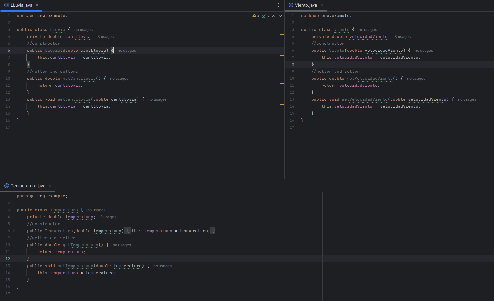
- se le asigna el atributo correspondiente a cada clase con su respectivo contructor y se añade los métodos getter and setter para poder manejar la clase. No se le añade todavía ninguna responsabilidad
### 2. Implementar estas clases asegurando que cada una tenga una única responsabilidad.
- Clases CON responsabilidad UNICA<br>
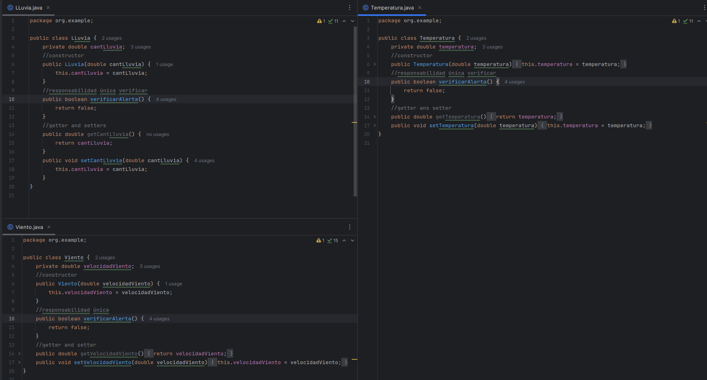
```java
    public boolean verificarAlerta() {
        return false;
    }
```
- se le añade la responsabilidad a cada clase con el método verificar alerta que indicará cuando se sobrepasa el límite permitido para condiciones consideradas "normales"
- se le deja a todos con el retorno por defecto false pues se va aplicar TDD más adelante para implementarlo
### explicación y observaciones de los resultados mostrados
- el método verificarAlerta() en todos los métodos devolverán un booleano y los límites puestos para cada condición son referenciales
- se imprime una alerta para verificar si la condición se está cumpliendo, pero cuando ya no se necesite se borrarán
- los test se implementaron antes de incluir la funcionalidad (responsabilidad única), pero para seguir el orden propuesto en el examen se indica antes
## Desarrollo con TDD:
### 1. Escribir pruebas unitarias para cada clase antes de implementar la funcionalidad.
#### LLuvia
```java
class LLuviaTest {
    LLuvia lluvia;
    @BeforeEach
    void setUp() {
        lluvia = new LLuvia(0); // Inicializamos con 0 mm de lluvia para cada test
    }
    @AfterEach
    void tearDown() {
        lluvia = null; // Limpiar
    }
    @Test
    void verificarAlertaConLluviaIntensa() {
        lluvia.setCantLluvia(25); //desencadenar una alerta
        assertTrue(lluvia.verificarAlerta(), "RESULTADO true para lluvia intensa");
    }
    @Test
    void verificarAlertaSinLluviaIntensa() {
        lluvia.setCantLluvia(15); //no desencadenar una alerta
        assertFalse(lluvia.verificarAlerta(), "RESULTADO false para lluvia no intensa");
    }
    @Test
    void verificarAlertaEnElUmbral() {
        lluvia.setCantLluvia(20); //umbral
        assertFalse(lluvia.verificarAlerta(), "RESULTADO false porque 20 no es mayor que 20");
    }
    @Test
    void verificarAlertaPorEncimaDelUmbral() {
        lluvia.setCantLluvia(20.1); //por encima del umbral
        assertTrue(lluvia.verificarAlerta(), "RESULTADO true porque 20.1 es mayor que 20");
    }
}
```
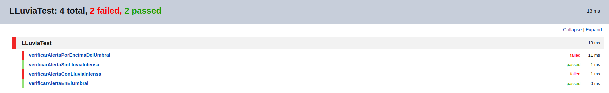
- Explicación de cada test:
    - verificarAlertaConLluviaIntensa: Este test verifica que la alerta se active cuando la cantidad de lluvia es claramente superior al umbral de alerta (25 mm).
    - verificarAlertaSinLluviaIntensa: Comprueba que no se active la alerta cuando la lluvia está por debajo del umbral de alerta (15 mm).
    - verificarAlertaEnElUmbral: Testea que no se active la alerta cuando la cantidad de lluvia es exactamente igual al umbral de 20 mm, dado que la condición es cantLluvia > 20.
    - verificarAlertaPorEncimaDelUmbral: Prueba que la alerta se active cuando la cantidad de lluvia es apenas superior al umbral (20.1 mm).
#### Temperatura
```java
class TemperaturaTest {
    Temperatura temperatura;
    @BeforeEach
    void setUp() {
        temperatura = new Temperatura(0); // Inicializamos con 0 grados Celsius para cada test
    }
    @AfterEach
    void tearDown() {
        temperatura = null; // Limpiar
    }
    @Test
    void verificarAlertaConTemperaturaAlta() {
        temperatura.setTemperatura(25); //desencadenar una alerta
        assertTrue(temperatura.verificarAlerta(), "RESULTADO true para una temperatura alta");
    }
    @Test
    void verificarAlertaSinTemperaturaAlta() {
        temperatura.setTemperatura(15); //no desencadenar una alerta
        assertFalse(temperatura.verificarAlerta(), "RESULTADO false para una temperatura no alta");
    }
    @Test
    void verificarAlertaEnElUmbral() {
        temperatura.setTemperatura(20); // umbral
        assertFalse(temperatura.verificarAlerta(), "RESULTADO false porque 20 no es mayor que 20");
    }
    @Test
    void verificarAlertaPorEncimaDelUmbral() {
        temperatura.setTemperatura(20.1); //encima del umbral
        assertTrue(temperatura.verificarAlerta(), "RESULTADO true porque 20.1 es mayor que 20");
    }
}
```  
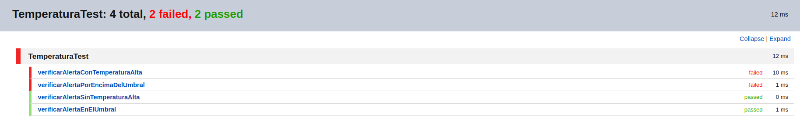
- Descripción de cada test:
    - verificarAlertaConTemperaturaAlta: Este test verifica que la alerta se active cuando la temperatura es claramente superior al umbral (25°C en este caso).
    - verificarAlertaSinTemperaturaAlta: Este test verifica que no se active la alerta cuando la temperatura está por debajo del umbral (15°C).
    - verificarAlertaEnElUmbral: Este test verifica que no se active la alerta cuando la temperatura es exactamente igual al umbral de 20°C, dado que la condición es temperatura > 20.
    - verificarAlertaPorEncimaDelUmbral: Este test verifica que la alerta se active cuando la temperatura es apenas superior al umbral (20.1°C).
#### Viento
```java
class VientoTest {
    Viento viento;
    @BeforeEach
    void setUp() {
        viento = new Viento(0); // Inicializamos con 0 km/h para cada test
    }
    @AfterEach
    void tearDown() {
        viento = null; // Limpiar
    }
    @Test
    void verificarAlertaConVientoFuerte() {
        viento.setVelocidadViento(55); //desencadenar una alerta
        assertTrue(viento.verificarAlerta(), "RESULTADO true para viento fuerte");
    }
    @Test
    void verificarAlertaSinVientoFuerte() {
        viento.setVelocidadViento(45); //no desencadenar una alerta
        assertFalse(viento.verificarAlerta(), "RESULTADO false para viento no fuerte");
    }
    @Test
    void verificarAlertaEnElUmbral() {
        viento.setVelocidadViento(50); //umbral
        assertFalse(viento.verificarAlerta(), "RESULTADO false porque 50 no es mayor que 50");
    }
    @Test
    void verificarAlertaPorEncimaDelUmbral() {
        viento.setVelocidadViento(50.1); //por encima del umbral
        assertTrue(viento.verificarAlerta(), "RESULTADO true porque 50.1 es mayor que 50");
    }
}
```  
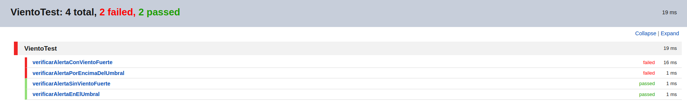
- Explicación de cada test:
    - verificarAlertaConVientoFuerte: Este test asegura que la alerta se active cuando la velocidad del viento sea significativamente mayor al umbral establecido de 50 km/h.
    - verificarAlertaSinVientoFuerte: Este test verifica que no se active la alerta cuando la velocidad del viento está por debajo del umbral.
    - verificarAlertaEnElUmbral: Testea que no se active la alerta cuando la velocidad del viento es exactamente igual al umbral, ya que la condición es velocidadViento > 50.
    - verificarAlertaPorEncimaDelUmbral: Prueba que la alerta se active cuando la velocidad del viento es ligeramente superior al umbral (50.1 km/h).
### Implementar la funcionalidad necesaria para que las pruebas pasen.
- se implementa la modificación en la responsabilidad de cada clase para que las pruebas pasen
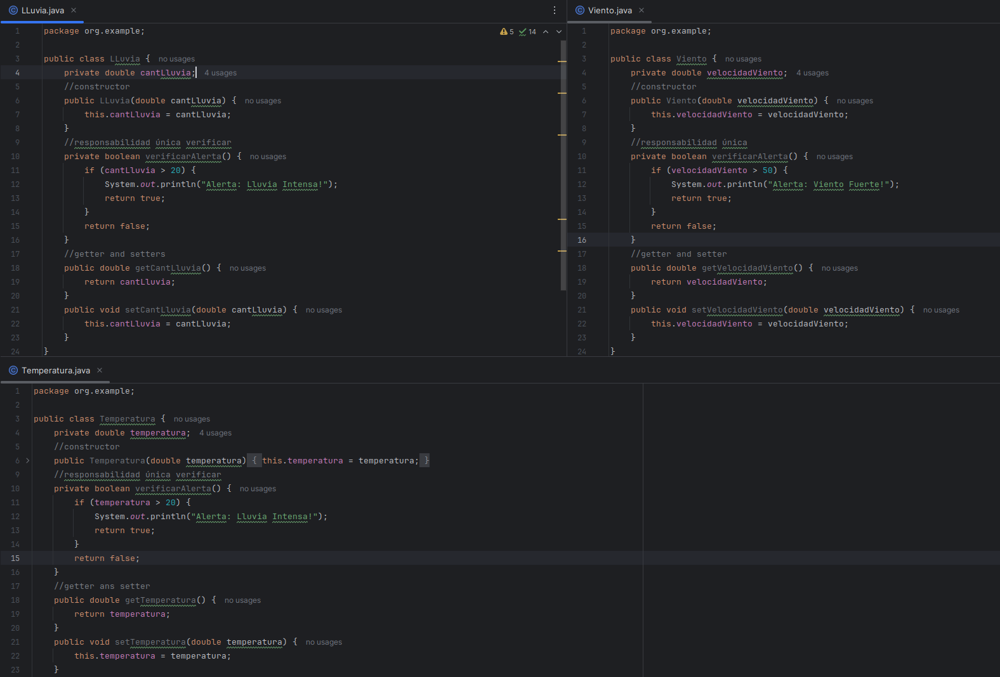
#### LLuvia
```java
        public boolean verificarAlerta() {
            if (cantLluvia > 20) {
                System.out.println("Alerta: Lluvia Intensa!");
                return true;
            }
            return false;
        }
```
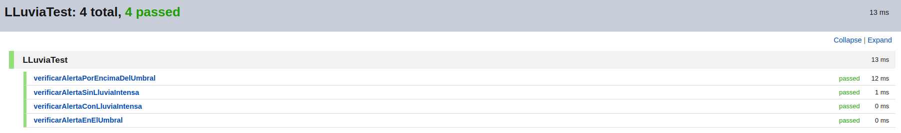
- Explicación: se le añadió una condicional con `umbral 20 para la cantidad de lluvia` en la que, si sobrepasa ese límite, se activará la alerta
#### Temperatura
```java
    public boolean verificarAlerta() {
        if (temperatura > 20) {
            System.out.println("Alerta: Lluvia Intensa!");
            return true;
        }
        return false;
    }
```
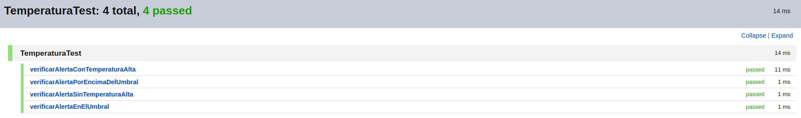
- Explicación: se le añadió una condicional con `umbral 20 para la medida de la temperatura` en la que, si sobrepasa ese límite, se activará la alerta
#### Viento
```java
    public boolean verificarAlerta() {
        if (velocidadViento > 50) {
            System.out.println("Alerta: Viento Fuerte!");
            return true;
        }
        return false;
    }
```
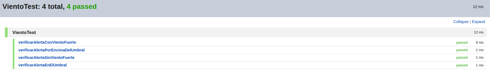
- Explicación: se le añadió una condicional con `umbral 50 para la velocidad del viento` en la que, si sobrepasa ese límite, se activará la alerta
### 3. Refactorizar el código después de que las pruebas pasen para mantenerlo limpio.
#### Se implementa una clase abstrac 
- EXPLICACION: Dado que las tres clases comparten una estructura y comportamiento similares, se genera una clase base abstracta que maneje la lógica común. Esto incluye el almacenamiento del valor medido (temperatura, cantidad de lluvia, velocidad del viento) y la funcionalidad de verificar una alerta, que se puede personalizar en cada subclase.
```java
public abstract class Sensor {
    protected double valor;
    public Sensor(double valor) {
        this.valor = valor;
    }
    // Método abstracto que debe ser implementado por cada sensor específico
    public abstract boolean verificarAlerta();
    public double getValor() {
        return valor;
    }
    public void setValor(double valor) {
        this.valor = valor;
    }
}
```
#### Se colocan constantes llamadas umbrales
- EXPLICACION: Cada subclase define su propio umbral de alerta como una constante, lo cual mejora la claridad y la facilidad de mantenimiento.
```java
public class LLuvia extends Sensor {
    private static final double UMBRAL_LLUVIA_INTENSA = 20;
public class Temperatura extends Sensor {
    private static final double UMBRAL_TEMPERATURA_ALTA = 20;
public class Viento extends Sensor {
    private static final double UMBRAL_VIENTO_FUERTE = 50;
```
#### Separación de Alertas y Verificaciones: 
- EXPLICACION:La lógica para emitir alertas se maneja en un método separado (alerta), siguiendo el principio de responsabilidad única y mejorando la cohesión del código.
```JAVA
    private void alerta(String mensaje) {
        System.out.println("Alerta: " + mensaje + "!");
    }
```
#### presentación
- Las clases quedarían de la siguiente forma
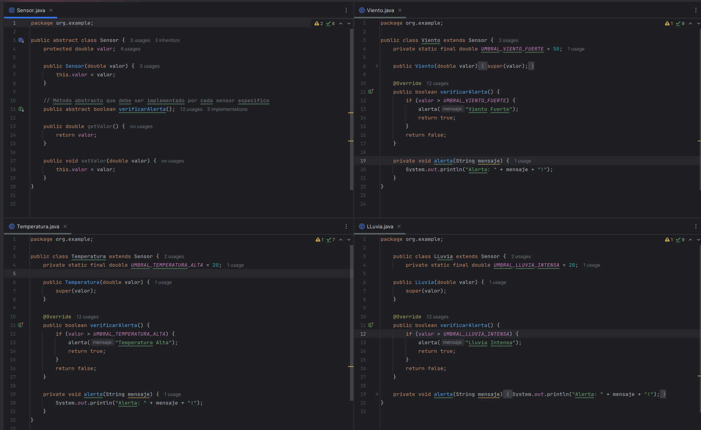
- Al incluir la clase SEnsor también se cambio el nombre de los setter por uno único llamado `setValor()` por lo que se tendrá que cambiar en todos los test para que sigan pasando con normalidad
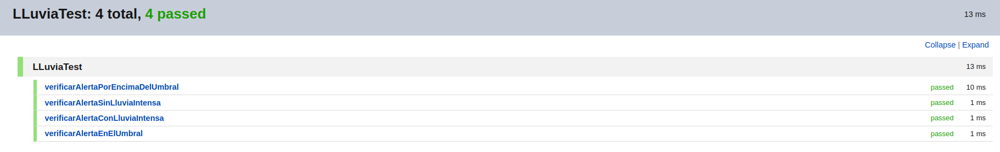
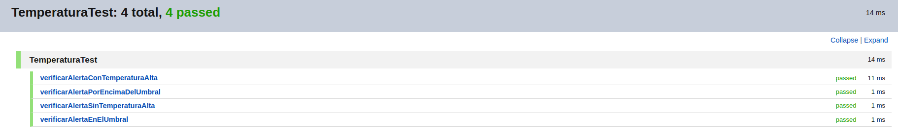
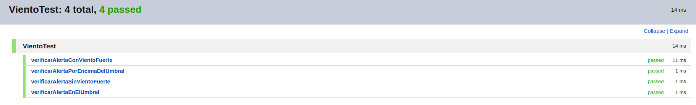
- Explicación: los cambios que se realizaron permiten que los test sigan siendo aceptados con normalidad para que pasen, de lo contrario no reconocerían las anteriores funciones que fueron renombradas con el abstrac
## Validación de pruebas con stubs y fakes:
### 1. Crear stubs para simular las condiciones climáticas
#### PRIMERO:1. creo interfaz para los Datos del Clima
### 2. Implementar fakes para simular escenarios de prueba más complejos

## Refactorización y código limpio:
1. Refactorizar el código regularmente para mejorar la legibilidad y mantenibilidad.
2. Aplicar principios de diseño limpio y patrones de diseño adecuados.
## Métricas de calidad:
1. Utilizar herramientas para medir la cobertura de pruebas (Jacoco)
2. Evaluar la complejidad del código utilizando métricas como la complejidad ciclomática.

