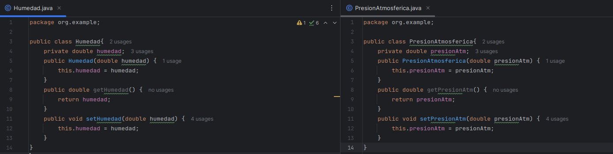
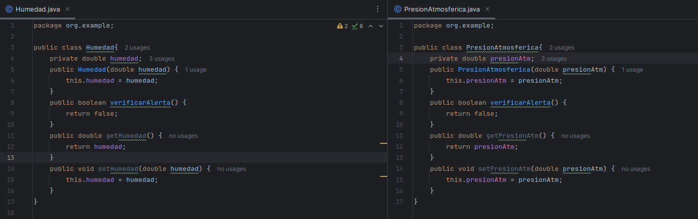
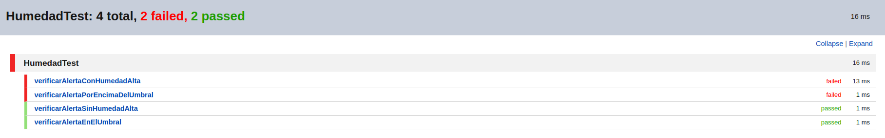
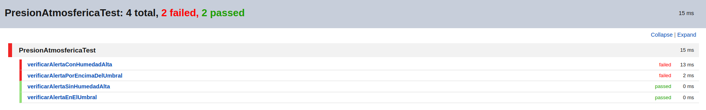
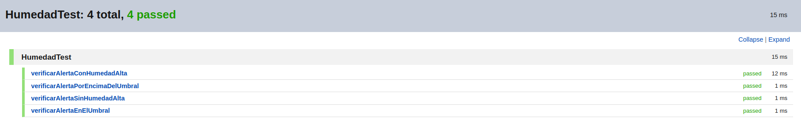
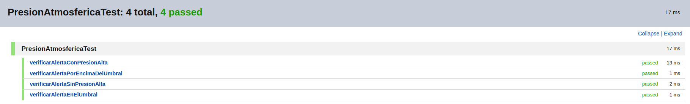
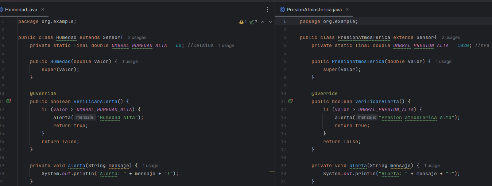
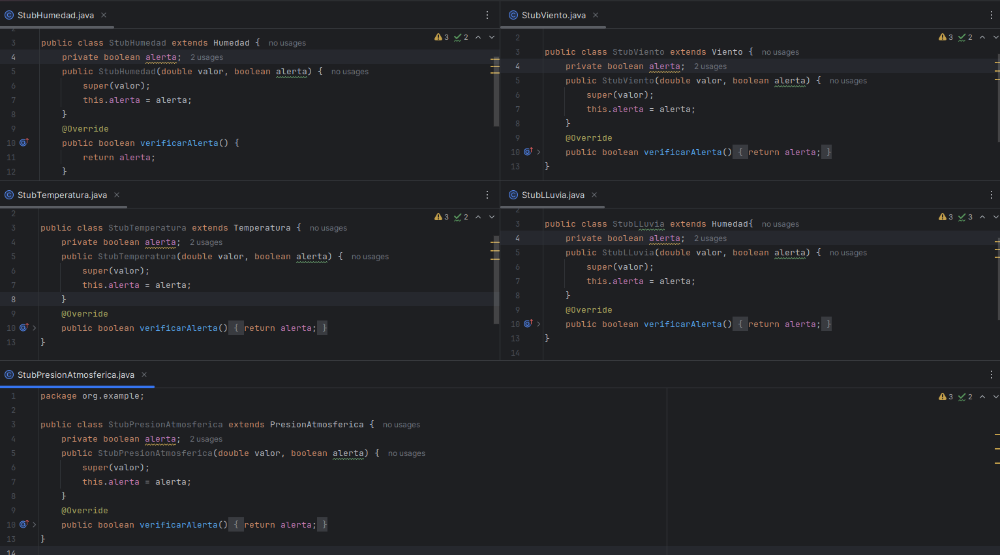

# solucionario
# SPRINT 1
## Diseño y implementación inicial
### 1. Diseñar las clases responsables de manejar las condiciones climáticas (Temperatura, Lluvia, Viento)+(Humedad, PresionAtmosferica).
- Clases SIN responsabilidades<br>


- En cada clase con un NOMBRE que lo describe se le asigna el atributo correspondiente a cada uno con su respectivo contructor y se añade los métodos getter and setter para poder manejar la clase.
- No se le añade todavía ninguna responsabilidad como se indica
### 2. Implementar estas clases asegurando que cada una tenga una única responsabilidad.
- Clases CON responsabilidad UNICA<br>


```java
    public boolean verificarAlerta() {
        return false;
    }
```
- se le añade la responsabilidad a cada clase con el método verificar alerta que indicará cuando se sobrepasa el límite permitido para condiciones consideradas "normales"
- se le deja a todos con el retorno por defecto false pues se va aplicar TDD más adelante para implementarlo
### explicación y observaciones de los resultados mostrados
- el método verificarAlerta() en todos los métodos devolverán un booleano y los límites puestos para cada condición son referenciales
- se imprime una alerta para verificar si la condición se está cumpliendo, pero cuando ya no se necesite se borrarán
- los test se implementaron antes de incluir la funcionalidad (responsabilidad única), pero para seguir el orden propuesto en el examen se indica antes
## Desarrollo con TDD:
### 1. Escribir pruebas unitarias para cada clase antes de implementar la funcionalidad.
#### LLuvia
```java
class LLuviaTest {
    LLuvia lluvia;
    @BeforeEach
    void setUp() {
        lluvia = new LLuvia(0); // Inicializamos con 0 mm de lluvia para cada test
    }
    @AfterEach
    void tearDown() {
        lluvia = null; // Limpiar
    }
    @Test
    void verificarAlertaConLluviaIntensa() {
        lluvia.setCantLluvia(25); //desencadenar una alerta
        assertTrue(lluvia.verificarAlerta(), "RESULTADO true para lluvia intensa");
    }
    @Test
    void verificarAlertaSinLluviaIntensa() {
        lluvia.setCantLluvia(15); //no desencadenar una alerta
        assertFalse(lluvia.verificarAlerta(), "RESULTADO false para lluvia no intensa");
    }
    @Test
    void verificarAlertaEnElUmbral() {
        lluvia.setCantLluvia(20); //umbral
        assertFalse(lluvia.verificarAlerta(), "RESULTADO false porque 20 no es mayor que 20");
    }
    @Test
    void verificarAlertaPorEncimaDelUmbral() {
        lluvia.setCantLluvia(20.1); //por encima del umbral
        assertTrue(lluvia.verificarAlerta(), "RESULTADO true porque 20.1 es mayor que 20");
    }
}
```
- Explicación de cada test:
    - verificarAlertaConLluviaIntensa: Este test verifica que la alerta se active cuando la cantidad de lluvia es claramente superior al umbral de alerta (25 mm).
    - verificarAlertaSinLluviaIntensa: Comprueba que no se active la alerta cuando la lluvia está por debajo del umbral de alerta (15 mm).
    - verificarAlertaEnElUmbral: Testea que no se active la alerta cuando la cantidad de lluvia es exactamente igual al umbral de 20 mm, dado que la condición es cantLluvia > 20.
    - verificarAlertaPorEncimaDelUmbral: Prueba que la alerta se active cuando la cantidad de lluvia es apenas superior al umbral (20.1 mm).


- Explicación: se verifica que dos test no pasan (porEncimaUmbral y conLLuviaIntensa), debido a que ambas deberían retornar un valor TRUE ya que no sobrepasan el umbral de 20mm, pero por defecto está puesto como false para cualquier ingreso, por lo que al no coincidir aparecen en rojo
#### Temperatura
```java
class TemperaturaTest {
    Temperatura temperatura;
    @BeforeEach
    void setUp() {
        temperatura = new Temperatura(0); // Inicializamos con 0 grados Celsius para cada test
    }
    @AfterEach
    void tearDown() {
        temperatura = null; // Limpiar
    }
    @Test
    void verificarAlertaConTemperaturaAlta() {
        temperatura.setTemperatura(25); //desencadenar una alerta
        assertTrue(temperatura.verificarAlerta(), "RESULTADO true para una temperatura alta");
    }
    @Test
    void verificarAlertaSinTemperaturaAlta() {
        temperatura.setTemperatura(15); //no desencadenar una alerta
        assertFalse(temperatura.verificarAlerta(), "RESULTADO false para una temperatura no alta");
    }
    @Test
    void verificarAlertaEnElUmbral() {
        temperatura.setTemperatura(20); // umbral
        assertFalse(temperatura.verificarAlerta(), "RESULTADO false porque 20 no es mayor que 20");
    }
    @Test
    void verificarAlertaPorEncimaDelUmbral() {
        temperatura.setTemperatura(20.1); //encima del umbral
        assertTrue(temperatura.verificarAlerta(), "RESULTADO true porque 20.1 es mayor que 20");
    }
}
```  
- Descripción de cada test:
    - verificarAlertaConTemperaturaAlta: Este test verifica que la alerta se active cuando la temperatura es claramente superior al umbral (25°C en este caso).
    - verificarAlertaSinTemperaturaAlta: Este test verifica que no se active la alerta cuando la temperatura está por debajo del umbral (15°C).
    - verificarAlertaEnElUmbral: Este test verifica que no se active la alerta cuando la temperatura es exactamente igual al umbral de 20°C, dado que la condición es temperatura > 20.
    - verificarAlertaPorEncimaDelUmbral: Este test verifica que la alerta se active cuando la temperatura es apenas superior al umbral (20.1°C).
- 
- Explicación: se verifica que dos test no pasan (conTemperaturaAlta y porEncimaUmbral), debido a que ambas deberían retornar un valor TRUE ya que no sobrepasan el umbral de 20°C, pero por defecto está puesto como false para cualquier ingreso, por lo que al no coincidir aparecen en rojo
#### Viento
```java
class VientoTest {
    Viento viento;
    @BeforeEach
    void setUp() {
        viento = new Viento(0); // Inicializamos con 0 km/h para cada test
    }
    @AfterEach
    void tearDown() {
        viento = null; // Limpiar
    }
    @Test
    void verificarAlertaConVientoFuerte() {
        viento.setVelocidadViento(55); //desencadenar una alerta
        assertTrue(viento.verificarAlerta(), "RESULTADO true para viento fuerte");
    }
    @Test
    void verificarAlertaSinVientoFuerte() {
        viento.setVelocidadViento(45); //no desencadenar una alerta
        assertFalse(viento.verificarAlerta(), "RESULTADO false para viento no fuerte");
    }
    @Test
    void verificarAlertaEnElUmbral() {
        viento.setVelocidadViento(50); //umbral
        assertFalse(viento.verificarAlerta(), "RESULTADO false porque 50 no es mayor que 50");
    }
    @Test
    void verificarAlertaPorEncimaDelUmbral() {
        viento.setVelocidadViento(50.1); //por encima del umbral
        assertTrue(viento.verificarAlerta(), "RESULTADO true porque 50.1 es mayor que 50");
    }
}
```  
- Explicación de cada test:
    - verificarAlertaConVientoFuerte: Este test asegura que la alerta se active cuando la velocidad del viento sea significativamente mayor al umbral establecido de 50 km/h.
    - verificarAlertaSinVientoFuerte: Este test verifica que no se active la alerta cuando la velocidad del viento está por debajo del umbral.
    - verificarAlertaEnElUmbral: Testea que no se active la alerta cuando la velocidad del viento es exactamente igual al umbral, ya que la condición es velocidadViento > 50.
    - verificarAlertaPorEncimaDelUmbral: Prueba que la alerta se active cuando la velocidad del viento es ligeramente superior al umbral (50.1 km/h).
- 
- Explicación: se verifica que dos test no pasan (porEncimaUmbral y conVientoFuertes), debido a que ambas deberían retornar un valor TRUE ya que no sobrepasan el umbral de 50km/h, pero por defecto está puesto como false para cualquier ingreso, por lo que al no coincidir aparecen en rojo
#### Humedad
```java
class HumedadTest {
    Humedad humedad;
    @BeforeEach
    void setUp() {
        humedad = new Humedad(0); // Inicializamos con 0 porcentaje
    }
    @AfterEach
    void tearDown() {
        humedad = null; // Limpiar
    }
    @Test
    void verificarAlertaConHumedadAlta() {
        humedad.setHumedad(65); //desencadenar una alerta
        assertTrue(humedad.verificarAlerta(), "Debería retornar true para humedad alta");
    }
    @Test
    void verificarAlertaSinHumedadAlta() {
        humedad.setHumedad(55); //no desencadenar una alerta
        assertFalse(humedad.verificarAlerta(), "Debería retornar false para humedad alta");
    }
    @Test
    void verificarAlertaEnElUmbral() {
        humedad.setHumedad(60); //umbral
        assertFalse(humedad.verificarAlerta(), "Debería retornar false porque 60 no es mayor que 60");
    }
    @Test
    void verificarAlertaPorEncimaDelUmbral() {
        humedad.setHumedad(60.1); //por encima del umbral
        assertTrue(humedad.verificarAlerta(), "Debería retornar true porque 60.1 es mayor que 60");
    }
}
```  
- Descripción de cada test:
    - verificarAlertaConHumedadAlta: Este test verifica que la alerta se active cuando la humedad es claramente superior al umbral (65% en este caso).
    - verificarAlertaSinHumedadAlta: Este test verifica que no se active la alerta cuando la humedad está por debajo del umbral (55%).
    - verificarAlertaEnElUmbral: Este test verifica que no se active la alerta cuando la temperatura es exactamente igual al umbral de 60%, dado que la condición es humedad > 60.
    - verificarAlertaPorEncimaDelUmbral: Este test verifica que la alerta se active cuando la humedad es apenas superior al umbral (60.1%).
- 
- Explicación: se verifica que dos test no pasan (porEncimaUmbral y conHumedadAlta), debido a que ambas deberían retornar un valor TRUE ya que no sobrepasan el umbral de 60%, pero por defecto está puesto como false para cualquier ingreso, por lo que al no coincidir aparecen en rojo
#### PresionAtm
```java
class PresionAtmosfericaTest {
    PresionAtmosferica presionAtmosferica;  //hPa
    @BeforeEach
    void setUp() {
        presionAtmosferica = new PresionAtmosferica(0); // Inicializamos con 0 hPa
    }
    @AfterEach
    void tearDown() {
        presionAtmosferica = null; // Limpiar
    }
    @Test
    void verificarAlertaConHumedadAlta() {
        presionAtmosferica.setPresionAtm(1025); //desencadenar una alerta
        assertTrue(presionAtmosferica.verificarAlerta(), "Debería retornar true para alta presion atmosferica");
    }
    @Test
    void verificarAlertaSinHumedadAlta() {
        presionAtmosferica.setPresionAtm(1015); //no desencadenar una alerta
        assertFalse(presionAtmosferica.verificarAlerta(), "Debería retornar false para alta presion atmosferica");
    }
    @Test
    void verificarAlertaEnElUmbral() {
        presionAtmosferica.setPresionAtm(1020); //umbral
        assertFalse(presionAtmosferica.verificarAlerta(), "Debería retornar false porque 1020 no es mayor que 1020");
    }
    @Test
    void verificarAlertaPorEncimaDelUmbral() {
        presionAtmosferica.setPresionAtm(1020.1); //por encima del umbral
        assertTrue(presionAtmosferica.verificarAlerta(), "Debería retornar true porque 1020.1 es mayor que 1020");
    }
}
```  
- Descripción de cada test:
    - verificarAlertaConHumedadAlta: Este test verifica que la alerta se active cuando la presion atmosferica es claramente superior al umbral (1020hPa en este caso).
    - verificarAlertaSinHumedadAlta: Este test verifica que no se active la alerta cuando la presion atmosferica está por debajo del umbral (1020hPa).
    - verificarAlertaEnElUmbral: Este test verifica que no se active la alerta cuando la presion atmosferica es exactamente igual al umbral de 1020hPa, dado que la condición es temperatura > 1020.
    - verificarAlertaPorEncimaDelUmbral: Este test verifica que la alerta se active cuando la presion atmosferica es apenas superior al umbral (1020hPa).
- 
- Explicación: se verifica que dos test no pasan (porEncimaUmbral y conPresion), debido a que ambas deberían retornar un valor TRUE ya que no sobrepasan el umbral de 1020hPa, pero por defecto está puesto como false para cualquier ingreso, por lo que al no coincidir aparecen en rojo 
### Implementar la funcionalidad necesaria para que las pruebas pasen.
- se implementa la modificación en la responsabilidad de cada clase para que las pruebas pasen

#### LLuvia
```java
        public boolean verificarAlerta() {
            if (cantLluvia > 20) {
                System.out.println("Alerta: Lluvia Intensa!");
                return true;
            }
            return false;
        }
```

- Explicación: se le añadió una condicional con `umbral 20 para la cantidad de lluvia` en la que, si sobrepasa ese límite, se activará la alerta. Esto permite que las pruebas sean distingidas si pasan o no por el umbral
#### Temperatura
```java
    public boolean verificarAlerta() {
        if (temperatura > 20) {
            System.out.println("Alerta: Lluvia Intensa!");
            return true;
        }
        return false;
    }
```

- Explicación: se le añadió una condicional con `umbral 20 para la medida de la temperatura` en la que, si sobrepasa ese límite, se activará la alerta.  Esto permite que las pruebas sean distingidas si pasan o no por el umbral
#### Viento
```java
    public boolean verificarAlerta() {
        if (velocidadViento > 50) {
            System.out.println("Alerta: Viento Fuerte!");
            return true;
        }
        return false;
    }
```

- Explicación: se le añadió una condicional con `umbral 50 para la velocidad del viento` en la que, si sobrepasa ese límite, se activará la alerta.  Esto permite que las pruebas sean distingidas si pasan o no por el umbral
#### Humedad
```java
    public boolean verificarAlerta() {
        if (humedad > 60) {
            System.out.println("Alerta: Humedad ALTA!");
            return true;
        }
        return false;
    }
```

- Explicación: se le añadió una condicional con `umbral 60% de humedad` en la que, si sobrepasa ese límite, se activará la alerta.  Esto permite que las pruebas sean distingidas si pasan o no por el umbral
#### Presion Atmosferica
```java
    public boolean verificarAlerta() {
        if (presionAtm > 1020) {
            System.out.println("Alerta: Presion atmosferica ALTA!");
            return true;
        }
        return false;
    }
```

- Explicación: se le añadió una condicional con `umbral 1020hPa para la presion atmosferica` en la que, si sobrepasa ese límite, se activará la alerta.  Esto permite que las pruebas sean distingidas si pasan o no por el umbral.
### 3. Refactorizar el código después de que las pruebas pasen para mantenerlo limpio.
#### Se implementa una clase abstrac 
- EXPLICACION: Dado que las tres clases comparten una estructura y comportamiento similares, se genera una clase base abstracta que maneje la lógica común. Esto incluye el almacenamiento del valor medido (temperatura, cantidad de lluvia, velocidad del viento) y la funcionalidad de verificar una alerta, que se puede personalizar en cada subclase.
```java
public abstract class Sensor {
    protected double valor;
    public Sensor(double valor) {
        this.valor = valor;
    }
    // Método abstracto que debe ser implementado por cada sensor específico
    public abstract boolean verificarAlerta();
    public double getValor() {
        return valor;
    }
    public void setValor(double valor) {
        this.valor = valor;
    }
}
```
#### Se colocan constantes llamadas umbrales
- EXPLICACION: Cada subclase define su propio umbral de alerta como una constante, lo cual mejora la claridad y la facilidad de mantenimiento.
```java
public class LLuvia extends Sensor {
    private static final double UMBRAL_LLUVIA_INTENSA = 20;
public class Temperatura extends Sensor {
    private static final double UMBRAL_TEMPERATURA_ALTA = 20;
public class Viento extends Sensor {
    private static final double UMBRAL_VIENTO_FUERTE = 50;
public class Humedad extends Sensor{
    private static final double UMBRAL_HUMEDAD_ALTA = 60; //Celsius
public class PresionAtmosferica extends Sensor{
    private static final double UMBRAL_PRESION_ALTA = 1020; //hPa
```
#### Separación de Alertas y Verificaciones: 
- EXPLICACION:La lógica para emitir alertas se maneja en un método separado (alerta), siguiendo el principio de responsabilidad única y mejorando la cohesión del código.
```JAVA
    private void alerta(String mensaje) {
        System.out.println("Alerta: " + mensaje + "!");
    }
```
#### presentación
- Las clases quedarían de la siguiente forma


- Al incluir la clase Sensor también se cambio el nombre de los setter por uno único llamado `setValor()` por lo que se tendrá que cambiar en todos los test para que sigan pasando con normalidad


- Explicación: los cambios que se realizaron permiten que los test sigan siendo aceptados con normalidad para que pasen, de lo contrario no reconocerían las anteriores funciones que fueron renombradas con el abstrac
## Validación de pruebas con stubs y fakes:
### 1. Crear stubs para simular las condiciones climáticas
- EXPLICACIÓN: se crearán nuevas clases stub para cada clase que tenemos en la que al constructor se le añadirá un ingreso de la alerta que queremos simular
```java
public class StubHumedad extends Humedad {
    private boolean alerta;
    public StubHumedad(double valor, boolean alerta) {
        super(valor);
        this.alerta = alerta;
    }
    @Override
    public boolean verificarAlerta() {
        return alerta;
    }
}
```

- EXPLICACIÓN: en código solo se muestra la estructura para uno, pero en la imagen se verifica que fue creado uno para cada clase que teníamos estructurado
- También se debe indicar que se utilizó `extens` pues solo vamos a usarlo para casos particulares que nosotros determinaremos, por lo que se aplica la herencia
- se usará @Override para sobreescriber el método que vamos a simular de manera preestablecida y un ingreso adicional en el constructor con el valor simulado.
#### refactoriza clases
- Explicación: se observa que en cada clase se encuentra un método repetido que lo podemos incluir en el abstrac Sensor ya usado
- Se borra el siguiente código de las clases
```java
    private void alerta(String mensaje) {
        System.out.println("Alerta: " + mensaje + "!");
    }
```
- se añade el código a la clase Sensor (abstract)
```java
public abstract class Sensor {
    protected double valor;
    private double umbral;
    private String mensajeAlerta;
    public Sensor(double valor, double umbral, String mensajeAlerta) {
        this.valor = valor;
        this.umbral = umbral;
        this.mensajeAlerta = mensajeAlerta;
    }
    public boolean verificarAlerta() {
        if (valor > umbral) {
            alerta(mensajeAlerta);
            return true;
        }
        return false;
    }
    private void alerta(String mensaje) {
        System.out.println("Alerta: " + mensaje + "!");
    }
    public double getValor() {
        return valor;
    }
    public void setValor(double valor) {
        this.valor = valor;
    }
}
```
- las clases quedarían  reestructuradas de tal manera que tengan un mejor encapsulamiento y cumplir con la nueva herencia
```java
public class Humedad extends Sensor {
    private static final double UMBRAL_HUMEDAD_ALTA = 60; // Celsius
    public Humedad(double valor) {
        super(valor, UMBRAL_HUMEDAD_ALTA, "Humedad Alta");
    }
}
public class PresionAtmosferica extends Sensor {
    private static final double UMBRAL_PRESION_ALTA = 1020; // hPa
    public PresionAtmosferica(double valor) {
        super(valor, UMBRAL_PRESION_ALTA, "Presión Atmosférica Alta");
    }
}
public class LLuvia extends Sensor {
    private static final double UMBRAL_LLUVIA_INTENSA = 20; // mm
    public LLuvia(double valor) {
        super(valor, UMBRAL_LLUVIA_INTENSA, "Lluvia Intensa");
    }
}
public class Temperatura extends Sensor {
    private static final double UMBRAL_TEMPERATURA_ALTA = 20; // Celsius
    public Temperatura(double valor) {
        super(valor, UMBRAL_TEMPERATURA_ALTA, "Temperatura Alta");
    }
}
public class Viento extends Sensor {
    private static final double UMBRAL_VIENTO_FUERTE = 50; // km/h
    public Viento(double valor) {
        super(valor, UMBRAL_VIENTO_FUERTE, "Viento Fuerte");
    }
}
```
#### refactoriza stups
- EXPLICACION: en el caso de particular de los stups verificamos que el cambio en las otras clases no ha afectado a su estrucutura gracias a un mejor encapsulamiento y uso de herencias, por lo que no es necesario ningún cambio. Como método de comprobación verificaremos que todos los test sigan pasando


### 2. Implementar fakes para simular escenarios de prueba más complejos
- vamos a crear una clase FakeClima para gestionar múltiples sensores y simular diferentes condiciones climáticas
## Refactorización y código limpio:
### 1. Refactorizar el código regularmente para mejorar la legibilidad y mantenibilidad.
#### 2. Aplicar principios de diseño limpio y patrones de diseño adecuados.
## Métricas de calidad:
### 1. Utilizar herramientas para medir la cobertura de pruebas (Jacoco)
### 2. Evaluar la complejidad del código utilizando métricas como la complejidad ciclomática.

# SPRINT 2

