# Contrucción BÁSICA
clases según lo indicado sin implementar funcionalidades del juego. Solo se incluyen getters y setters. Se le añade la clase Posicion con funcionalidades simples de contrucción para un mejor manejo.
```java
//getters y setters obviados
public class Posicion {
    private int fila;
    private int columna;
    public Posicion(int fila, int columna) {
        this.fila = fila;
        this.columna = columna;
    }
}
public class Jugador {
    private Posicion posicion;
    private int puntaje = 0;
    private int vida = 3;
    public void mover(Posicion nueva) {
        //********** funcionalidad **********
    }
    public void actualizarPosicion(Posicion nueva) {
        //********** funcionalidad **********
    }
    public boolean verificarColision(Posicion nueva) {
        //********** funcionalidad **********
        return false;
    }
}
public class Laberinto {
    private final int TAMANO = 10;
    private char[][] tablero;
    public Posicion iniciar() {
        //********** funcionalidad **********
    }
    public void mostrar() {
        //********** funcionalidad **********
    }
}
import java.util.Scanner;
public class Juego {
    public Laberinto laberinto = new Laberinto();
    public Jugador jugador = new Jugador();
    public void iniciar() {
        //********** funcionalidad **********
    }
    public void procesarComando(char direccion) {
        //********** funcionalidad **********
    }
    public boolean verificarEstado() {
        //********** funcionalidad **********
        return true;
    }
    public static void main(String[] args) {
        Juego juego = new Juego();
        juego.laberinto.mostrar();
        Scanner in = new Scanner(System.in);
        while(juego.verificarEstado()) {
            System.out.println("MENÚ\n - N: Norte\n - S: Sur\n - E: Este\n - O: Oeste");
            System.out.print("Ingrese movimiento (letra): ");
            char direccion = in.next().charAt(0);
            juego.procesarComando(direccion);
            System.out.println("\tPOSICION ACTUAL : " + juego.jugador.getPosicion() + "\n");
            juego.laberinto.mostrar();
        }
    }
}
```
### Ejecutando: ...resultado
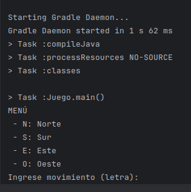
# Aplicar TDD
1. Escribimos el primer test para mover ... prueba falla
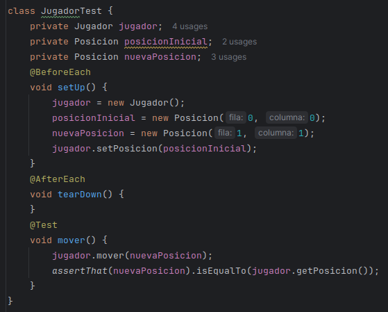
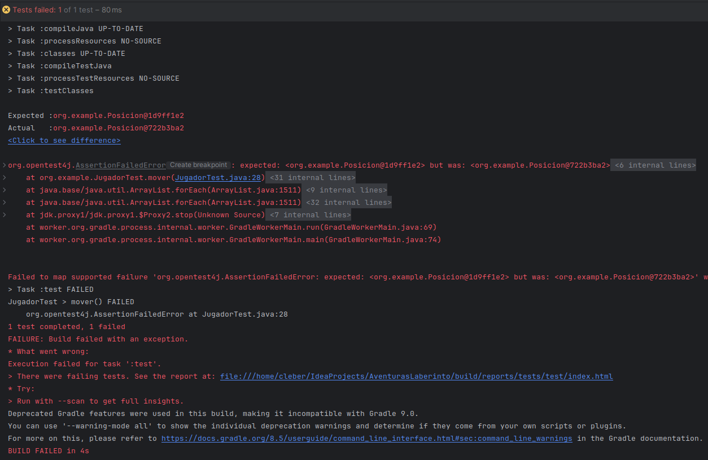
2. Corregimos el método `mover()`... prueba pasa
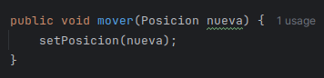
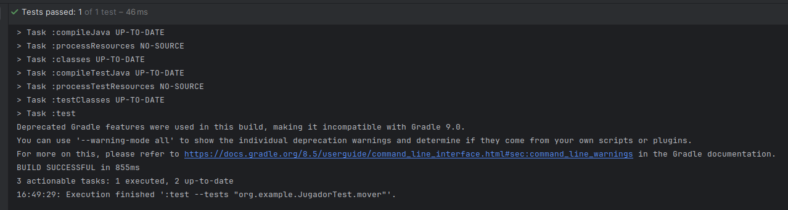
3. Seguimos con los demás... solo se presentarán los cambios y resultados NO EL PASO A PASO (hubo un error en la interpretación del problema, pero seguimos corrigiendo)
- se ecriben los test qeu no pasan
```java
public class JugadorTest {
    private Jugador jugador;
    private Posicion posicionInicial;
    private Posicion posicionValida;
    private Posicion posicionInvalida1;
    private Posicion posicionInvalida2;

    @BeforeEach
    public void setUp() {
        jugador = new Jugador();
        posicionInicial = new Posicion(0, 0);
        posicionValida = new Posicion(5, 5);
        posicionInvalida1 = new Posicion(-1, 5);
        posicionInvalida2 = new Posicion(10, 10);
        jugador.setPosicion(posicionInicial);
    }

    @Test
    public void testVerificarColision() {
        assertThat(jugador.verificarColision(posicionValida)).isFalse();
        assertThat(jugador.verificarColision(posicionInvalida1)).isTrue();
        assertThat(jugador.verificarColision(posicionInvalida2)).isTrue();
    }

    @Test
    public void testActualizarPosicionValida() {
        jugador.actualizarPosicion(posicionValida);
        assertTrue(jugador.getPosicion().equals(posicionValida));
    }

    @Test
    public void testActualizarPosicionInvalida() {
        jugador.actualizarPosicion(posicionInvalida1);
        assertFalse(jugador.getPosicion().equals(posicionInvalida1));
    }

    @Test
    public void testMoverValido() {
        jugador.mover(posicionValida);
        assertThat(jugador.getPosicion()).isEqualTo(posicionValida);
    }
    @Test
    public void testMoverInvalido() {
        jugador.mover(posicionInvalida1);
        assertThat(jugador.getPosicion()).isEqualTo(posicionInicial);
    }
}
```
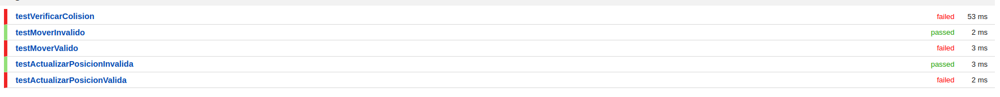
- escribimos las funcionalidades
```java
public void mover(Posicion nueva) {
        actualizarPosicion(nueva);
    }

    public void actualizarPosicion(Posicion nueva) {
        if(!verificarColision(nueva)) {
            setPosicion(nueva);
        }
    }

    public boolean verificarColision(Posicion nueva) {
        if( nueva.getFila()<0 || nueva.getFila()>9 ||
                nueva.getColumna()<0 || nueva.getColumna()>9) {
            return true;
        }
        return false;
    }
```
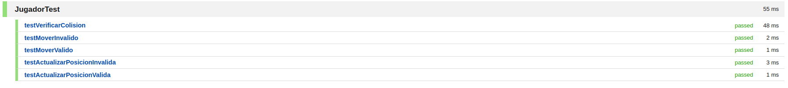
4. hacemos lo mismo para las demás clases
```java
public class LaberintoTest {
    private Laberinto laberinto;

    @BeforeEach
    public void setUp() {
        laberinto = new Laberinto();
    }

    @Test
    public void testIniciar() {
        Posicion posicionInicial = laberinto.iniciar();
        char[][] tablero = laberinto.getTablero();

        assertThat(tablero).isNotNull();
        assertThat(tablero.length).isEqualTo(10);
        for (int i = 0; i < tablero.length; i++) {
            assertThat(tablero[i].length).isEqualTo(10);
        }

        boolean foundP = false;
        for (int i = 0; i < tablero.length; i++) {
            for (int j = 0; j < tablero[i].length; j++) {
                char cell = tablero[i][j];
                assertThat(cell).isIn('.', 'T', 'X', 'P');
                if (cell == 'P') {
                    assertThat(posicionInicial.getFila()).isEqualTo(i);
                    assertThat(posicionInicial.getColumna()).isEqualTo(j);
                    foundP = true;
                }
            }
        }
        assertThat(foundP).isTrue();
    }
}
public class JuegoTest {
    private Juego juego;

    @BeforeEach
    public void setUp() {
        juego = new Juego();
        juego.iniciar();
    }

    @Test
    public void testIniciar() {
        Posicion posicionInicial = juego.jugador.getPosicion();
        assertNotNull(posicionInicial);
        assertEquals('P', juego.laberinto.getTablero()[posicionInicial.getFila()][posicionInicial.getColumna()]);
    }

    @Test
    public void testProcesarComando_Norte() {
        Posicion posicionInicial = juego.jugador.getPosicion();
        juego.procesarComando('N');
        Posicion nuevaPosicion = juego.jugador.getPosicion();
        if (posicionInicial.getFila() > 0) {
            assertEquals(posicionInicial.getFila() - 1, nuevaPosicion.getFila());
        } else {
            assertEquals(posicionInicial.getFila(), nuevaPosicion.getFila());
        }
    }

    @Test
    public void testProcesarComando_Sur() {
        Posicion posicionInicial = juego.jugador.getPosicion();
        juego.procesarComando('S');
        Posicion nuevaPosicion = juego.jugador.getPosicion();
        if (posicionInicial.getFila() < 9) {
            assertEquals(posicionInicial.getFila() + 1, nuevaPosicion.getFila());
        } else {
            assertEquals(posicionInicial.getFila(), nuevaPosicion.getFila());
        }
    }

    @Test
    public void testProcesarComando_Este() {
        Posicion posicionInicial = juego.jugador.getPosicion();
        juego.procesarComando('E');
        Posicion nuevaPosicion = juego.jugador.getPosicion();
        if (posicionInicial.getColumna() < 9) {
            assertEquals(posicionInicial.getColumna() + 1, nuevaPosicion.getColumna());
        } else {
            assertEquals(posicionInicial.getColumna(), nuevaPosicion.getColumna());
        }
    }

    @Test
    public void testProcesarComando_Oeste() {
        Posicion posicionInicial = juego.jugador.getPosicion();
        juego.procesarComando('O');
        Posicion nuevaPosicion = juego.jugador.getPosicion();
        if (posicionInicial.getColumna() > 0) {
            assertEquals(posicionInicial.getColumna() - 1, nuevaPosicion.getColumna());
        } else {
            assertEquals(posicionInicial.getColumna(), nuevaPosicion.getColumna());
        }
    }

    @Test
    public void testVerificarEstado() {
        assertTrue(juego.verificarEstado());
        char[][] tablero = juego.laberinto.getTablero();
        for (int i = 0; i < tablero.length; i++) {
            for (int j = 0; j < tablero[i].length; j++) {
                tablero[i][j] = '.';
            }
        }
        juego.laberinto.setTablero(tablero);
        assertFalse(juego.verificarEstado());
    }
}
```
Resultados 
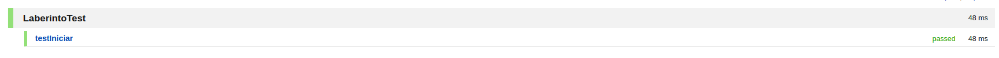
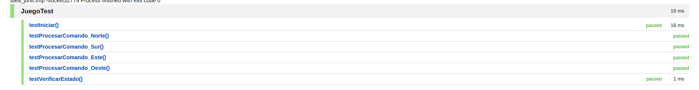
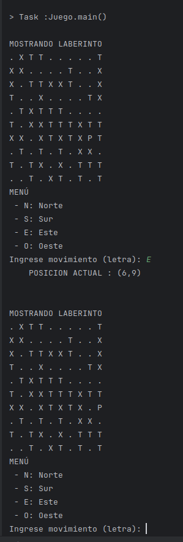
## Refactorizar
#### CLASE Jugador
- Uso de constantes: Usar constantes para los valores límite.
- Validación en setters: Añadir validaciones en los setters para puntaje y vida.
```java
public class Jugador {
    private static final int MIN_POSICION = 0;
    private static final int MAX_POSICION = 9;

    private Posicion posicion;
    private int puntaje;
    private int vida;

    public void mover(Posicion nueva) {
        actualizarPosicion(nueva);
    }

    public void actualizarPosicion(Posicion nueva) {
        if (!verificarColision(nueva)) {
            setPosicion(nueva);
        }
    }

    public boolean verificarColision(Posicion nueva) {
        return nueva.getFila() < MIN_POSICION || nueva.getFila() > MAX_POSICION ||
                nueva.getColumna() < MIN_POSICION || nueva.getColumna() > MAX_POSICION;
    }

    public Posicion getPosicion() {
        return posicion;
    }

    public void setPosicion(Posicion posicion) {
        if (posicion == null) {
            throw new IllegalArgumentException("La posición no puede ser nula.");
        }
        this.posicion = posicion;
    }

    public int getPuntaje() {
        return puntaje;
    }

    public void setPuntaje(int puntaje) {
        if (puntaje < 0) {
            throw new IllegalArgumentException("El puntaje no puede ser negativo.");
        }
        this.puntaje = puntaje;
    }

    public int getVida() {
        return vida;
    }

    public void setVida(int vida) {
        if (vida < 0) {
            throw new IllegalArgumentException("La vida no puede ser negativa.");
        }
        this.vida = vida;
    }
}
```
#### CLASE Laberinto
- Métodos privados: Extraer lógica de inicialización a métodos privados para una mejor modularidad.
- Simplificación del bucle de impresión: Utilizar un bucle for-each para simplificar la impresión del laberinto.
```java
public class Laberinto {
    private static final int TAMANO = 10;
    private char[][] tablero;

    public Posicion iniciar() {
        this.tablero = new char[TAMANO][TAMANO];
        llenarTableroConElementos();
        return colocarJugadorEnTablero();
    }

    private void llenarTableroConElementos() {
        Random rand = new Random();
        for (int i = 0; i < TAMANO; i++) {
            for (int j = 0; j < TAMANO; j++) {
                tablero[i][j] = generarElementoAleatorio(rand);
            }
        }
    }

    private char generarElementoAleatorio(Random rand) {
        switch (rand.nextInt(3)) {
            case 0: return '.';
            case 1: return 'T';
            case 2: return 'X';
            default: throw new IllegalStateException("Valor aleatorio fuera de rango");
        }
    }

    private Posicion colocarJugadorEnTablero() {
        Random rand = new Random();
        int fila = rand.nextInt(TAMANO);
        int columna = rand.nextInt(TAMANO);
        tablero[fila][columna] = 'P';
        return new Posicion(fila, columna);
    }

    public void mostrar() {
        System.out.println("\nMOSTRANDO LABERINTO");
        for (char[] fila : tablero) {
            for (char celda : fila) {
                System.out.print(celda + " ");
            }
            System.out.println();
        }
    }

    public char[][] getTablero() {
        return tablero;
    }

    public void setTablero(char[][] tablero) {
        this.tablero = tablero;
    }

    public int getTAMANO() {
        return TAMANO;
    }
}
```
#### CLASE Juego
- Separación de lógica: Extraer la lógica de movimiento y verificación de estado en métodos privados.
- Simplificación del método procesarComando: Extraer la lógica de cálculo de nueva posición en un método privado.
```java
public class Juego {
    public Laberinto laberinto = new Laberinto();
    public Jugador jugador = new Jugador();

    public void iniciar() {
        Posicion posicionJugador = laberinto.iniciar();
        jugador.setPosicion(posicionJugador);
    }

    public void procesarComando(char direccion) {
        Posicion nuevaPosicion = calcularNuevaPosicion(direccion);
        if (!jugador.verificarColision(nuevaPosicion)) {
            moverJugador(nuevaPosicion);
        }
    }

    private Posicion calcularNuevaPosicion(char direccion) {
        int fila = jugador.getPosicion().getFila();
        int columna = jugador.getPosicion().getColumna();
        switch (direccion) {
            case 'N': return new Posicion(fila - 1, columna);
            case 'S': return new Posicion(fila + 1, columna);
            case 'E': return new Posicion(fila, columna + 1);
            case 'O': return new Posicion(fila, columna - 1);
            default: return new Posicion(-1, -1);
        }
    }

    private void moverJugador(Posicion nuevaPosicion) {
        laberinto.getTablero()[jugador.getPosicion().getFila()][jugador.getPosicion().getColumna()] = '.';
        laberinto.getTablero()[nuevaPosicion.getFila()][nuevaPosicion.getColumna()] = 'P';
        jugador.mover(nuevaPosicion);
    }

    public boolean verificarEstado() {
        for(int i = 0; i < laberinto.getTAMANO(); i++) {
            for(int j = 0; j < laberinto.getTAMANO(); j++) {
                if(laberinto.getTablero()[i][j]=='T') {
                    return true;
                }
            }
        }
        return false;
    }

    public static void main(String[] args) {
        Juego juego = new Juego();
        juego.iniciar();
        juego.laberinto.mostrar();
        Scanner in = new Scanner(System.in);
        while (juego.verificarEstado()) {
            System.out.println("MENÚ\n - N: Norte\n - S: Sur\n - E: Este\n - O: Oeste");
            System.out.print("Ingrese movimiento (letra): ");
            char direccion = in.next().charAt(0);
            juego.procesarComando(direccion);
            System.out.println("\tPOSICION ACTUAL : (" + juego.jugador.getPosicion().getFila() + "," + juego.jugador.getPosicion().getColumna() + ")\n");
            juego.laberinto.mostrar();
        }
    }
}
```
## Verificar los TEST
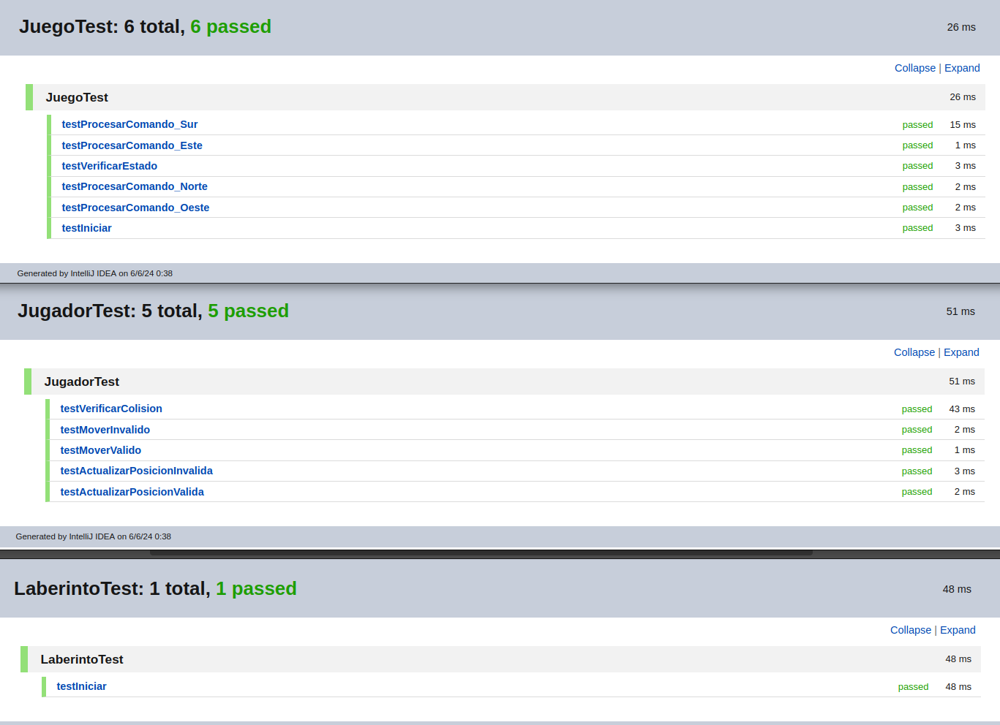