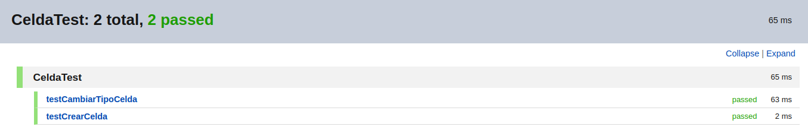
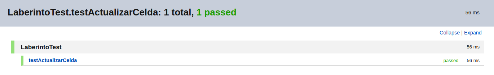
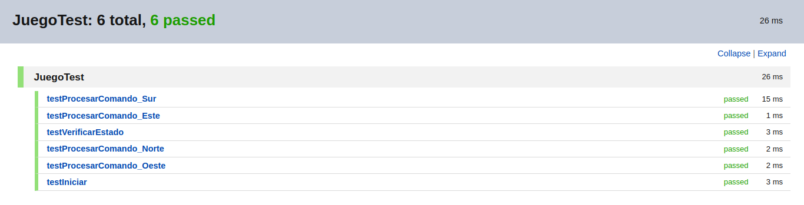
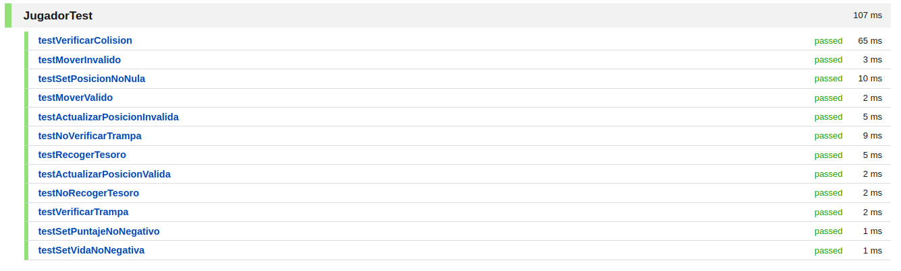
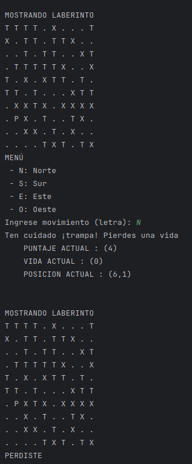

# Creación clase celda
```java
public class Celda {
    private char tipo;

    public Celda(char tipo) {
        this.tipo = tipo;
    }

    public char obtenerTipo() {
        return tipo;
    }

    public void setTipo(char tipo) {
        this.tipo = tipo;
    }
}
```
- se crea su test, pero como no hay mayor funcionalidad pasa
```java
public class CeldaTest {
    char tipoInicial = 'X';
    Celda celda;
    @BeforeEach
    public void setUp() {
        celda = new Celda(tipoInicial);
    }

    @Test
    public void testCrearCelda() {
        assertThat(celda).isNotNull();
        assertThat(celda.obtenerTipo()).isEqualTo(tipoInicial);
    }

    @Test
    public void testCambiarTipoCelda() {
        char tipoNuevo = 'T';
        celda.setTipo(tipoNuevo);
        assertThat(celda.obtenerTipo()).isEqualTo(tipoNuevo);
    }
}
```

# Modificar clase Laberinto
- en la refactorización anterior habíamos creado el método `generarElementoAleatorio` y solo se le cambiará de nombre pues es exactamente lo que se pide. se mantiene privado porque solo se usa dentro de la claswe
```java 
private char colocarTesoroTrampa() {
        Random rand = new Random();
        switch (rand.nextInt(3)) {
            case 0: return '.';
            case 1: return 'T';
            case 2: return 'X';
            default: throw new IllegalStateException("Valor aleatorio fuera de rango");
        }
    }
```
- antes de seguir modificamos para que podamos utilizar la clase Celda en vez de char
```bash 
private char[][] tablero;  -->> private Celda[][] tablero;
tablero[i][j] = colocarTesoroTrampa(rand); -->> actualizarCelda(tablero[fila][columna],'P');
```
- añadimos la clase actualizarCelda y realizamos las modificaciones necesarias para que siga funcionando correctamente gracias a la nueva clase Celda
```java
public void actualizarCelda(Celda[][] tablero, int fila, int columna, char nuevoTipo) {
        //********** funcionalidad **********
    }
```
- creamos test para `actualizarCelda` que no pase
```java 
@Test
    public void testActualizarCelda() {
        int fila = posicionInicial.getFila();
        int columna = posicionInicial.getColumna();

        assertThat(tablero[fila][columna].obtenerTipo()).isEqualTo('P');
        laberinto.actualizarCelda(tablero, fila, columna, '.');
        assertThat(tablero[fila][columna].obtenerTipo()).isEqualTo('.');
    }
```
- aumentamos funcionalidad y que pase
```java
public void actualizarCelda(Celda[][] tablero, int fila, int columna, char nuevoTipo) {
        tablero[fila][columna] = new Celda(nuevoTipo);
    }
```

# Modificar clase JUGADOR
- añadimos nuevos métodos
```java 
public void recogerTesoro(Celda celda) {
        //********** funcionalidad **********
    }

    public boolean verificarTrampa(Celda celda) {
        //********** funcionalidad **********
    }
```
- creamos su test para `recogerTesoro` y `verificarTrampa`
```java
 @Test
    public void testRecogerTesoro() {
        Celda tesoro = new Celda('T');
        int puntajeInicial = jugador.getPuntaje();
        jugador.recogerTesoro(tesoro);
        assertThat(jugador.getPuntaje()).isEqualTo(puntajeInicial + 1);
    }

    @Test
    public void testNoRecogerTesoro() {
        Celda noTesoro = new Celda('.');
        int puntajeInicial = jugador.getPuntaje();
        jugador.recogerTesoro(noTesoro);
        assertThat(jugador.getPuntaje()).isEqualTo(puntajeInicial);
    }

    @Test
    public void testVerificarTrampa() {
        Celda trampa = new Celda('X');
        int vidaInicial = jugador.getVida();
        assertTrue(jugador.verificarTrampa(trampa));
        assertThat(jugador.getVida()).isEqualTo(vidaInicial - 1);
    }

    @Test
    public void testNoVerificarTrampa() {
        Celda noTrampa = new Celda('.');
        int vidaInicial = jugador.getVida();
        assertFalse(jugador.verificarTrampa(noTrampa));
        assertThat(jugador.getVida()).isEqualTo(vidaInicial);
    }
```
- implementamos las funcionalidades
```java
public void recogerTesoro(Celda celda) {
        if(celda.obtenerTipo() == 'T') {
            setPuntaje(getPuntaje()+1);
            System.out.println("Felicidades, hemos conseguido un tesoro!!!");
        }
    }

    public boolean verificarTrampa(Celda celda) {
        if(celda.obtenerTipo() == 'X') {
            setVida(getVida()-1);
            return true;
        }
        return false;
    }
```


# Modificar clase JUEGO
- añadimos nuevos métodos
```java 
    public boolean actulizarEstado() {
         //********** funcionalidad **********
        return false;
    }
    public void verificarVicDerr() {
         //********** funcionalidad **********
    }
```
- creamos su test para `actulizarEstado` y `verificarVicDerr`
```java
    @Test
    public void testActulizarEstado_VidaPositivaYConTesoro() {
        assertTrue(juego.actulizarEstado());
    }

    @Test
    public void testActulizarEstado_SinVida() {
        juego.jugador.setVida(0);
        assertFalse(juego.actulizarEstado());
        assertEquals("PERDISTE", juego.verificarVicDerr());
    }

    @Test
    public void testActulizarEstado_SinTesoros() {
        Celda[][] tablero = juego.laberinto.getTablero();
        for (int i = 0; i < tablero.length; i++) {
            for (int j = 0; j < tablero[i].length; j++) {
                juego.laberinto.actualizarCelda(juego.laberinto.getTablero(), i, j, '.');
            }
        }
        juego.laberinto.setTablero(tablero);
        assertFalse(juego.actulizarEstado());
        assertEquals("GANASTE", juego.verificarVicDerr());
    }

    @Test
    public void testVerificarVicDerr_Ganaste() {
        Celda[][] tablero = juego.laberinto.getTablero();
        for (int i = 0; i < tablero.length; i++) {
            for (int j = 0; j < tablero[i].length; j++) {
                juego.laberinto.actualizarCelda(juego.laberinto.getTablero(), i, j, '.');
            }
        }
        juego.laberinto.setTablero(tablero);
        assertEquals("GANASTE", juego.verificarVicDerr());
    }

    @Test
    public void testVerificarVicDerr_Perdite() {
        juego.jugador.setVida(0);
        assertEquals("PERDISTE", juego.verificarVicDerr());
    }
```
- implementamos las funcionalidades
```java
    public boolean actulizarEstado() {
        if(verificarEstado() && jugador.getVida()>0){
            return true;
        }
        System.out.println(verificarVicDerr());
        return false;
    }
    public String verificarVicDerr() {
        String mensaje = " ";
        if(jugador.getVida()==0) {
            mensaje = "PERDISTE";
        }
        else if (!verificarEstado()) {
            mensaje = "GANASTE";
        }
        return mensaje;
    }
```

- resultado de Ejecutar juego verificando Salidas 

