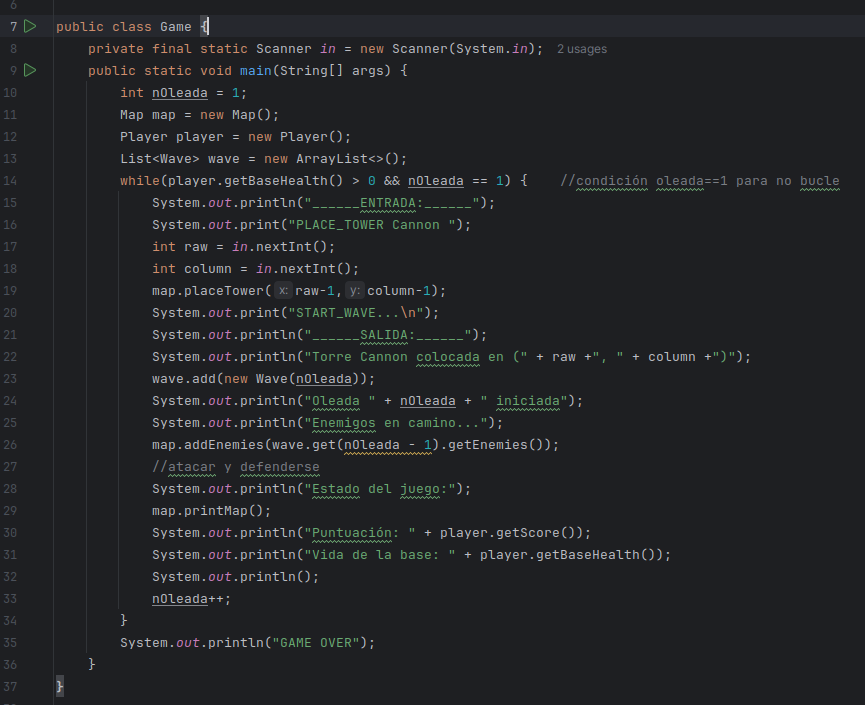
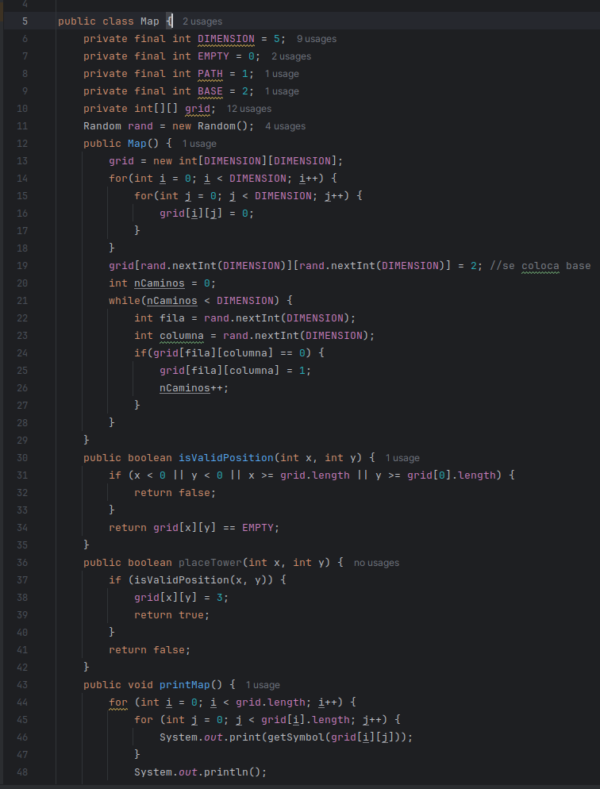
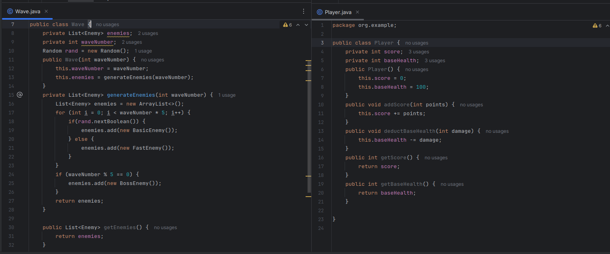
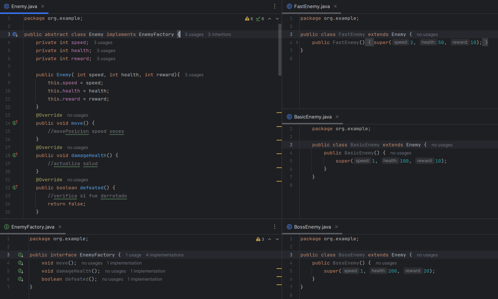
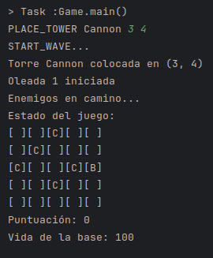

# RESOLUCIÓN
me basaré en el uso de TDD: primero crear clases sin implementar funcionalidades para escribir los test
## Implementación de pruebas
1. se crean las clases, interfaces y abstract que se identifican
    - class `Game`: Clase principal.lógica del juego.
    
    - class `Map`: Representa el mapa del juego.
    
    - class`Wave`: Maneja las oleadas de enemigos.
    - class `Player`: Representa al jugador y sus estadísticas.
    
    - interface `EnemyFactory`:
        - abstract class`Enemy`: Clase base para enemigos.
            - class `BasicEnemy`  ->  (1,100,10)
            - class `FastEnemy`   ->  (2,50,10)
            - class `BossEnemy`   ->  (1,200,20)
        - 
    - interface `TowerFactory`: 
        - abstract `Tower`: Clase base para todas las torres. 
            - class `CannonTower`  ->  (50,2,3)
            - class `LaserTower`   ->  (30,4,5)
            - class `ArrowTower`   ->  (10,3,8)
        - 

2. Resultado Inicial: pero lo curiosos es que se puede modificar para que las posiciones iniciales vayan cambiando
- 