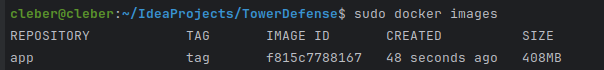
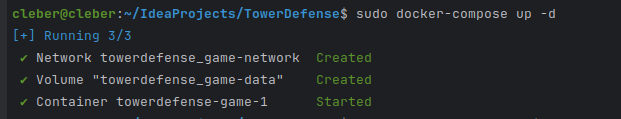
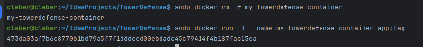

# SOLUCIÓN

## EJERCICIO 01
#### TEORÍA

1. Describe los principios fundamentales de los contenedores Docker y su arquitectura interna. Explica cómo Docker maneja la seguridad y el aislamiento de contenedores
- Principios fundamentales Docker
    - Empaquetamiento ligero: Docker encapsula aplicaciones y todas sus dependencias en contenedores ligeros que pueden ejecutarse de manera independiente en cualquier máquina con Docker instalado.
    - Portabilidad: Los contenedores Docker son portátiles, lo que significa que funcionan igual en cualquier lugar, desde el desarrollo hasta la producción, sin importar las diferencias en infraestructura.
    - Aislamiento: Cada contenedor ejecuta una aplicación de manera aislada, compartiendo recursos del sistema operativo subyacente de manera controlada, lo que asegura que las aplicaciones no interfieran entre sí.
    - Eficiencia: Utilizan recursos de manera eficiente al compartir el mismo núcleo de sistema operativo y solo incluir las librerías y binarios necesarios para la aplicación específica.
    - Escalabilidad y distribución: Facilitan la escala horizontal de aplicaciones al poder replicar contenedores de manera rápida y sencilla, distribuyéndolos en múltiples servidores si es necesario.Docker, que gestiona los contenedores.

- Seguridad y Aislamiento:  Docker utiliza `namespaces` para proporcionar aislamiento a nivel de sistema operativo, limitando las vistas de los procesos, red, usuarios, y otros recursos del sistema. Además, el `control Groups` limita y controla los recursos que un contenedor puede utilizar.

2. Docker vs. Virtualización Tradicional

característica | Docker | Virtualización
---------------|--------|------------------
eficiencia | Docker comparte el núcleo del sistema operativo del host, lo que reduce el overhead | tiene un núcleo, SO indipendiente, por lo que tiene un alto overhead
Portabilidad y time Despliegue | Docker permite un despliegue más rápido y portabilidad debido a la estandarización de contenedores | lentas de desplegar y menos portátiles debido a las diferencias en configuraciones de hardware y software
Aislamiento | Docker comparte el kernel del host y utiliza namespaces y cgroups para el aislamiento | Las VMs proporcionan aislamiento más fuerte ya que cada una tiene su propio kernel y recursos completamente separados
Seguridad | al compartir host, debe estar configurado correctamente, poque de lo contrario todo estaría expuesto | cada uno puede tener su nivel de seguridad y en caso de vulnerar uno los otros no quedarían expuestos inmediantamente

overhead: recursos adicionales que se requiere para realizar una tarea más allá de lo escencias
ivo completo.
    : , mientras que las VMs pueden ser más lentas de desplegar y menos portátiles debido a las diferencias en configuraciones de hardware y software.
    Aislamiento: , mientras que .

#### PRÁCTIVA

1. Escribe un Dockerfile para la aplicación Tower Defense que incluya la instalación de todas las dependencias necesarias. Asegúrate de optimizar el Dockerfile para reducir el tamaño de la imagen final
- Dockerfile con instalación de dependencias (imagen reducida)
  - configuración mostrada en clase
  ```bash
  FROM openjdk:17
  WORKDIR /app
  COPY . .
  RUN javac src/main/java/org/example/*.java
  CMD ["java", "-cp", "src/main/java", "org.example.Game"]
  ```
  ```bash
  docker build -t app:tag .
  ```
  
  ```bash
  docker images
  ```
  
    - mejoramos la imagen para reducirla. Se comenta los cambios
  ```bash
  # estamos utilizando openjdk17, por lo que buscaremos su versión light 
  FROM openjdk:17-slim as build
  WORKDIR /app
  # Solo copiamos los archivos necesarios: gradles(configuraciones) y src(proyecto). evitamos las configuraciones propias del IDEA-PROYECT
  COPY gradlew .      
  COPY gradle gradle
  COPY build.gradle .
  COPY settings.gradle .
  COPY src src
  # permisos gradle
  RUN chmod +x ./gradlew
  RUN ./gradlew build
  # Inicia una nueva etapa desde cero para solo mantener ejecutable RUN
  FROM openjdk:17-slim
  WORKDIR /app
  # lo volvemos ejecutable el proyecto
  COPY --from=build /app/build/libs/*.jar ./app.jar
  CMD ["java", "-jar", "app.jar"]
  ```
    - verificamos que sea una imagen mejor
  ```bash
  docker build -t app:tag .
  docker images
  ```
  
2. Construye y ejecuta el contenedor Docker utilizando el Dockerfile creado. Utiliza docker exec
para acceder al contenedor y verificar que la aplicación funcione correctamente
- para el caso de la imagen no reducida
  ```bash
  docker run --rm -it app:tag
  ```
  
  

  docker-compose
  ```bash
  docker-compose up -d
  ```
  
- ṕara el caso del a imagen reducida (jar)
  - primero debemos configurar build para que se pueda ejecutar el archivo .jar
  ```groovy
  //build.gradle
  jar {
    manifest {
        attributes(
                'Implementation-Title': 'Tower Defense Game',
                'Implementation-Version': version,
                // nombre de la clase principal
                'Main-Class': 'com.example.Game'
        )
    }
}
  ```
  ```bash
  # si se tiene otro contenedor con el mismo nombre se borra
  docker rm -f my-towerdefense-container
  # ejecutar contenerdor
  docker run -d --name my-towerdefense-container app:tag
  ```
  


4. deployment.yaml
```bash
apiVersion: apps/v1
kind: Deployment
metadata:
  name: tower-defense-deployment
spec:
  replicas: 1
  selector:
    matchLabels:
      app: tower-defense-game
  template:
    metadata:
      labels:
        app: tower-defense-game
    spec:
      containers:
        - name: tower-defense-game
          image: Game
          ports:
            - containerPort: 8080
```