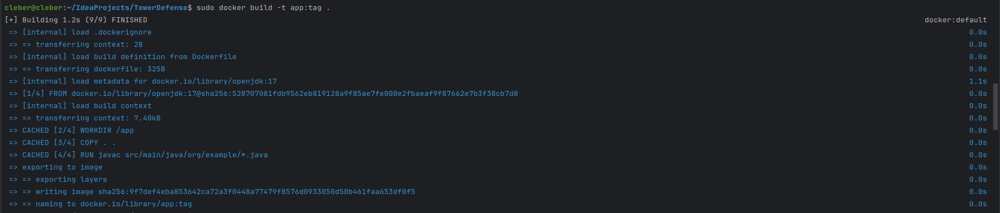
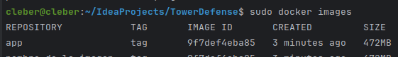
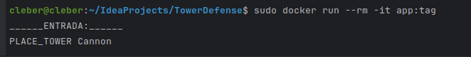
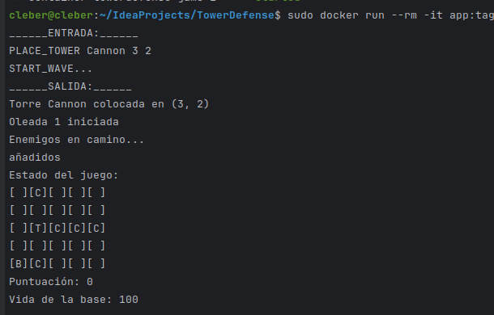

# SOLUCIÓN
1. nos aseguramos de que `Dockerfile` esté bien configurado 
```bash
FROM openjdk:17
WORKDIR /app
COPY . .
RUN javac src/main/java/org/example/*.java
CMD ["java", "-cp", "src/main/java", "org.example.Game"]
```
2. configuramos y ejecutamos
```bash
docker build -t app:tag .
```

```bash
docker images
```

```bash
docker run --rm -it app:tag
```



3. docker-compose
```bash
docker-compose up -d
```
